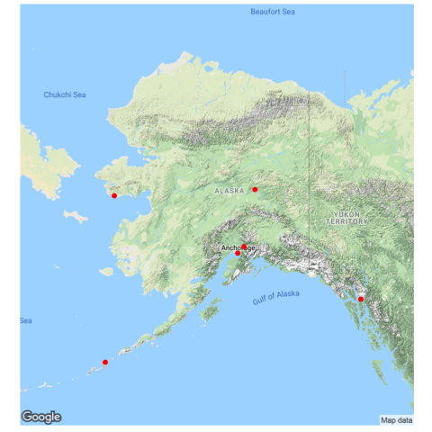

=============================================================

```{r packages, echo=FALSE, message=FALSE, warning=FALSE}
library(ggplot2)
library(dplyr)
library(tidyr)
library(scales)
library(ggmap)
library(ggthemes)
library(choroplethr)
library(choroplethrMaps)
library(grid)
library(gridExtra)
library(GGally)
library(png)
```


```{r global_options, echo=FALSE, include=FALSE}
knitr::opts_chunk$set(fig.align = 'center', warning=FALSE, message=FALSE)
```

##Data Source and Background Information 

The US Environmental Protection Agency maintains several public databases on environmental data.[^EPA] **RadNet**[^RadNetOverview] is a system of geographically distributed monitoring stations which sample and test for a number of analytes (e.g., gross beta (β), cesium-137, iodine-131) in the nation's air, precipitation, and drinking water. RadNet provides historical data to estimate long-term trends in environmental radiation levels and as a means to estimate levels of radioactivity in the environment. Stations are located across the US as well as American Territories. The database primarily consists of data collected since 1978 though some data dates back to 1973 from RadNet's precursor, ERAMS (Environmental Radiation Ambient Monitoring System).
 
[^EPA]:  <https://www.epa.gov/enviro/envirofacts-overview>
[^RadNetOverview]: <https://www.epa.gov/enviro/radnet-overview>

All data for this study was downloaded from the RadNet website in September 2017 as csv files. According to the EPA's [Envirofacts Data Service API](https://www.epa.gov/enviro/web-services) data output is limited to 10000 rows of data at a time from a maximum of three tables. Consequently, the  data for each material was downloaded by decade (up-to 1989, 1990-1999, 2000-2009, 2010-2017) and the resulting .csv files were loaded into RStudio and then merged[^merged] into a single R dataframe.

[^merged]: https://psychwire.wordpress.com/2011/06/03/merge-all-files-in-a-directory-using-r-into-a-single-dataframe/

```{r Load_Data, echo=FALSE, message=FALSE, warning=FALSE}
### To avoid re-appended data, dataframes are deleted when rerunning ### this chunk 
rm(air_data, drinking_water_data, Milk_data, precipitation_data, surface_water_data)

### Load/Append .csv files into 5 data frames, one for each media type
### air_data, drinking_water_data, Milk_data, precipitation_data, surface_water_data

dir_list <-  list.files('radnet_data/')

for (directory in dir_list){
  subdir <- (paste('radnet_data/', directory, sep=""))
  files_in_sub <- list.files(subdir)
  dfname <- paste(directory, '_data', sep="")  

  for (file in files_in_sub){
    file_loc <- paste(subdir, '/', file, sep="")
    # if the  dataset doesn't exist, create it
    if (!exists("db")){
        db <- read.csv(file_loc, header=TRUE)
    }
    # if the dataset does exist, append to it
    else if (exists("db")){
        temp_dataset <-read.csv(file_loc, header=TRUE)
        db <-rbind(db, temp_dataset)
       rm(temp_dataset)
    }
  }
  assign(dfname, db)
  remove(db)
}

### Cleanup Workspace
rm(dfname, dir_list, directory, file, file_loc, files_in_sub, subdir)

```

```{r consolidate_data, echo=FALSE, message=FALSE, warning=FALSE}
### First attempt to bind media datasets with loop failed
### List of dataframe names with 
### `as.list(names(which(sapply(.GlobalEnv, is.data.frame))))`
### [^df_names]:
### <http://r.789695.n4.nabble.com/getting-list-of-data-frame-names-td3864338.html>
### generates character list of dataframes (listofDF) not df object 
### dataframe names were finally hard coded into `bind_rows()`.

### convert SAMP_ID (INT) in surface_water_data to CHR as in other dfs
### ignore factor coercion to character vectors
surface_water_data$V_ERAMS_MATRIX_SAMPLE_ANALYSIS.SAMP_ID <-
  as.character(surface_water_data$V_ERAMS_MATRIX_SAMPLE_ANALYSIS.SAMP_ID)

### Consolidate media specific data into ONE dataframe: <rad_data_raw>
rad_data_raw <- bind_rows(list(air_data, drinking_water_data, 
                               Milk_data, precipitation_data,
                               surface_water_data),
                         .id ="id")
```

##Data Overview and Tidying 

The original raw consolidated dataframe has 19 variables and 504092 observations. One variable was added in the merge operation tracking the media dataframe from which the observation originated. From the first cursory glance, variables of interest were monitoring station locations, sample types (material) collected, and analytes. Dates and analysis amounts will be helpful in the investigation of these variables. 

Variable names were shortened and several variables were recast as factors with ordered levels where it made sense that an inmposed order may be useful, e.g., S(econd) < M(inute) < H(our) < D(ay) < Y(ear). In the event of possible date manipulations, the date field was changed to type DATE instead of CHR.[^as.Date]

[^as.Date]: <https://www.rdocumentation.org/packages/base/versions/3.4.1/topics/as.Date>.

```{r cleanup, echo=FALSE, message=FALSE, warning=FALSE}
#### Rename Variables 
colnames(surface_water_data) <-gsub('.+\\.','',colnames(surface_water_data))
colnames(Milk_data) <-gsub('.+\\.','',colnames(Milk_data))
colnames(air_data) <-gsub('.+\\.','',colnames(air_data))
colnames(precipitation_data) <-gsub('.+\\.','',colnames(precipitation_data))
colnames(drinking_water_data)<-
  gsub('.+\\.','',colnames(drinking_water_data))
colnames(rad_data_raw) <-gsub('.+\\.','',colnames(rad_data_raw))

#### level/order variables of limited categories 
### impose order, e.g., S(econd) < M(inute) < H(our) < D(ay) < Y(ear).

### (1) ID for original df source (numerical tie to media type)
###           1-5 :  (1) air_data, (2) drinking_water_data, 
###                  (3) Milk_data,(4)precipitation_data,
###                  (5) surface_water_data
rad_data_raw$id          <- factor(as.integer(rad_data_raw$id))
### (2) MAT_ID: material type e.g. Air, SW, DW, PPT, MILK
rad_data_raw$MAT_ID      <- factor(rad_data_raw$MAT_ID) 
### (5) ANA_UNIT: size of sample G,L,M3, MG, ML
rad_data_raw$ANA_UNIT    <- factor(rad_data_raw$ANA_UNIT)       
### (15) RESULT_UNIT: Result Units -> ACI/M3, DPM/GC, G/L, PCI/L, PCI/M3
rad_data_raw$RESULT_UNIT <- factor(rad_data_raw$RESULT_UNIT)
### (17) ANA_TYPE Analyte two types E (Element) and R (Radionuclide)
rad_data_raw$ANA_TYPE    <- factor(rad_data_raw$ANA_TYPE)
### (19) HALF_LIFE_TIME_UNIT: 5 Units of Half Life: S< M< H< D< Y
rad_data_raw$HALF_LIFE_TIME_UNIT <-
  factor(rad_data_raw$HALF_LIFE_TIME_UNIT,
         levels = c("S", "M", "H", "D", "Y"))

```

##Univariate Investigations

###Univariate Plots, Tables and Summaries

A quick summaries of the variables show the most common values and components of the database. Air-filter samples dominate as does the result unit pCi/m^3^ while the analytical sample size is split between liters (L) and cubic meters (m^3^).

```{r test_summaries, echo=FALSE, eval = FALSE, include=FALSE, warning=FALSE, message=FALSE}
#names(rad_data_raw)
#str(rad_data_raw)
summary(rad_data_raw$MAT_ID)
summary(rad_data_raw$RESULT_UNIT)
summary(rad_data_raw$ANA_UNIT)
```

#####Location Numbers, Cities, and States
The location numbers range from 1 to 4157, but there are only 324 unique sampling locations with most values <500, the distribution is a long tail right skeew. The location numbers correspond to 289 cities or regions in the US, US territories, the Pananma Canal (PC) or Ottawa, Canada (ON). Several cities have multiple monitoring stations, e.g., Oakridge, Tennesse has 11 different monitoring location numbers. 

```{r location_IDs, echo=FALSE, message=FALSE, warning=FALSE}
### LOC_NUM -> INT  1-4157, 324 distinct locs ####
summary(rad_data_raw$LOC_NUM)
#n_distinct(rad_data_raw$LOC_NUM)
ggplot(rad_data_raw, aes(LOC_NUM)) +
 geom_histogram(bins =100, fill = "salmon")+
 labs(title = "Analysis Counts by Location Number",
      x = "Location ID", y = "COUNT")+
 theme(plot.title = element_text(hjust = 0.5))
```

```{r location_city, echo=FALSE, message=FALSE, warning=FALSE, fig.width=10}
### City Locations ####
#n_distinct(rad_data_raw$CITY_NAME)

hoods <- rad_data_raw %>% 
  group_by(STATE_ABBR, CITY_NAME, LOC_NUM) %>% summarise(n = n()) %>% 
  group_by(CITY_NAME) %>% summarise(locations = n(), 
                                                observations = sum(n)) %>% 
  arrange(desc(observations))

ggplot(rad_data_raw, aes(reorder(CITY_NAME,-table(CITY_NAME)[CITY_NAME]))) + geom_bar()+
  labs(title = "Observations for Various Cities/Regions in RadNet",
      x = "CITY", y = "COUNT")+
  theme(plot.title = element_text(hjust = 0.5),
        axis.text.x = element_text(angle=60, size = 7) )+
  scale_x_discrete(breaks = (hoods$CITY_NAME)[seq(1, length(hoods$CITY_NAME), by = 4)])
 
city_obs_locs <- rad_data_raw %>% 
  group_by(STATE_ABBR, CITY_NAME, LOC_NUM) %>% summarise(n = n()) %>% 
  group_by(STATE_ABBR, CITY_NAME) %>% summarise(locations = n(), 
                                                observations = sum(n)) %>% 
  arrange(desc(locations))

head(city_obs_locs, 10)
```

The entries are not evenly distributed amongst the monitoring sites. Some sites have have $\geq$ 15,000 entries while others have only a single entry. Highly monitored states have $\geq$ 20,000 entries while some areas have < 500 entries. The top and bottom five locations, by city and state, are tabularized by number of observations for that location or area.

```{r EPA_regions, echo=FALSE, message=FALSE, warning=FALSE}
#### CITY_NAME -> CHR, 289 Distinct City, county or EPA Region ####

#### 10 EPA Regions changed to corresponding Headquarter City ####
### R01 New England (CT, ME, MA, NH, RI, VT and 10 tribal nations)
rad_data_raw$CITY_NAME[(rad_data_raw$STATE_ABBR == "R01")]   <- "BOSTON"
rad_data_raw$STATE_ABBR[(rad_data_raw$STATE_ABBR == "R01")]  <- "MA"
### R02 NJ,NY, Puerto Rico (PR), US VI and 8 tribal nations)
rad_data_raw$CITY_NAME[(rad_data_raw$STATE_ABBR == "R02")]   <- "New York City"
rad_data_raw$STATE_ABBR[(rad_data_raw$STATE_ABBR == "R02")]  <- "NY"
### R03 Mid-Atlantic (DE, DC, MD, PA, VA, WV)
rad_data_raw$CITY_NAME[(rad_data_raw$STATE_ABBR == "R03")]   <- "PHILADELPHIA"
rad_data_raw$STATE_ABBR[(rad_data_raw$STATE_ABBR == "R03")]  <- "PA"
### R04 Southeast (AL, FL, GA, KY, MS, NC, SC, TN and 6 tribes)
rad_data_raw$CITY_NAME[(rad_data_raw$STATE_ABBR == "R04")]   <- "ATLANTA"
rad_data_raw$STATE_ABBR[(rad_data_raw$STATE_ABBR == "R04")]  <- "GA"
### R05 IL, IN, MI, MN, OH, WI and 35 tribal nations                    
rad_data_raw$CITY_NAME[(rad_data_raw$STATE_ABBR == "R05")]   <- "CHICAGO"
rad_data_raw$STATE_ABBR[(rad_data_raw$STATE_ABBR == "R05")]  <- "IL"
### R06 South Central (AK, LA, NM, OK, TX and 66 tribal nations)      
rad_data_raw$CITY_NAME[(rad_data_raw$STATE_ABBR == "R06")]   <- "DALLAS"
rad_data_raw$STATE_ABBR[(rad_data_raw$STATE_ABBR == "R06")]  <- "TX"
### R07 Midwest (IA, KS, MO, NE and 9 tribal nations)
rad_data_raw$CITY_NAME[(rad_data_raw$STATE_ABBR == "R07")]   <- "KANSAS CITY"
rad_data_raw$STATE_ABBR[(rad_data_raw$STATE_ABBR == "R07")]  <- "KS"
### R08 Mountains and Plains (CO, MT, ND, SD, UT, WY and 27 tribal nations)
rad_data_raw$CITY_NAME[(rad_data_raw$STATE_ABBR == "R08")]  <- "DENVER"
rad_data_raw$STATE_ABBR[(rad_data_raw$STATE_ABBR == "R08")]  <- "CO"
### R09 Pacific Southwest (AZ, CA, HI, NV, Pacific Islands and 148 tribal nations)
rad_data_raw$CITY_NAME[(rad_data_raw$STATE_ABBR == "R09")]   <- "SAN FRANCISCO"
rad_data_raw$STATE_ABBR[(rad_data_raw$STATE_ABBR == "R09")]  <- "CA"
### R10 Pacific Northwest (AK, ID, OR, WA and 271 Native Tribes)
rad_data_raw$CITY_NAME[(rad_data_raw$STATE_ABBR == "R10")]   <- "SEATTLE"
rad_data_raw$STATE_ABBR[(rad_data_raw$STATE_ABBR == "R10")]  <- "WA"


staedte <- count(rad_data_raw,CITY_NAME)  # top cities have 5000-8000 rows
staedte <- staedte[order(staedte$n, decreasing = T),]

#### STATE_ABBR    ###############################################
###             -> 50 US States +
###                DC (District of Columbia)
###                US Territories : PR (Puerto Rico), GU (Guam), 
###                                 PC (Panama Canal), VI (Virgin Islands)
###                CNMI - Commonwealth of the No. Mariana Islands (Saipan)
###                EPA Regions R01- R10 -changed above to HDQs
###                ON Ottawa, ON
### geocode does not find 'PC', changed STATE_ABBR to 'Panama' 
### Doswell SC changed to Doswell VA
rad_data_raw$STATE_ABBR[(rad_data_raw$STATE_ABBR == "PC")] <- "PANAMA"
rad_data_raw$STATE_ABBR[(rad_data_raw$STATE_ABBR == "SC") &
                          (rad_data_raw$CITY_NAME == "DOSWELL")] <- "VA"

staat <- count(rad_data_raw,STATE_ABBR)  # top states
staat <- staat[order(staat$n, decreasing = T),]

mytabletheme <- gridExtra::ttheme_default(
    core = list(fg_params=list(cex = 0.5)),
    colhead = list(fg_params=list(cex = 0.5)),
    rowhead = list(fg_params=list(cex = 0.5)))

grid.arrange(tableGrob(head(staedte, n=5), theme = mytabletheme),
             tableGrob(head(staedte[order(staedte$n, decreasing = FALSE),], n=5),
                       theme = mytabletheme),
             tableGrob(head(staat, n=5), theme = mytabletheme),
             tableGrob(head(staat[order(staat$n, decreasing = FALSE),], n=5),
                       theme = mytabletheme),
             top = "City/State Most & Least Observations in RadNet Database",
             bottom = textGrob("EPA RADNet 1978-2017",
                               gp = gpar(fontface = 3, fontsize = 9),
                               hjust = 1,
                               x = 1),
             ncol = 2)
```

#####Geographical Representations
A simple search turned up the R package `ggmap`[^ggmap] which makes it possible to represent location information geographically.[^ggmap_vis]^,^[^ggmap_vis2]  The packages `choroplethr` and `choroplethrMaps` also allow for geographical representation of various values on a shaded and keyed `Choropleth Map`.[^choropleth]^,^[^choroplethr] Using the provided city and state information, the variables, latitude and longitude, were added for each location using the `geocode()` function.[^geocode]^,^[^geocode_csv]

[^ggmap]: http://cran.r-project.org/web/packages/ggmap/ggmap.pdf
[^ggmap_vis]: <https://blog.dominodatalab.com/geographic-visualization-with-rs-ggmaps/
[^ggmap-vis2]: D. Kahle and H. Wickham. ggmap: Spatial Visualization with ggplot2. The R Journal, ##5(1), 144-161. URL http://journal.r-project.org/archive/2013-1/kahle-wickham.pdf
[^geocode]: https://www.rdocumentation.org/packages/ggmap/versions/2.6.1/topics/geocode
[^geocode_csv]: http://www.storybench.org/geocode-csv-addresses-r/
[^choroplethr]: https://www.rdocumentation.org/packages/choroplethr/versions/3.6.1
[^choropleth]: https://en.wikipedia.org/wiki/Choropleth_map
[^eparegions]: https://www.epa.gov/aboutepa#pane-4

```{r csv_latlona, echo=FALSE, message=FALSE, warning=FALSE}
#### TO REDUCE RUN TIME lat/lon data obtained from Google Maps API was saved
#### to file "places_data.csv"                                          ####
#### Code for generating original file is chunk: get_latlona
#### Code chunk to obtain this info is set to "eval = FALSE" 
#### Geocode API now REQUIRES an API KEY !!!

places <- read.csv("places_data.csv", header=TRUE,
                   colClasses=c(CITY="character", STATE= "character",
                                citystate = "character", 
                                lat = "numeric", lon = "numeric",
                                address = "character"))
```

```{r get_latlona, eval=FALSE, include=FALSE, echo=FALSE, message=FALSE, warning=FALSE}
########################################################################
###  CHANGE eval=TRUE to run this code
###  Generate file with lat/lon geo data for City/State 
###  WARNING THIS CHUNK DOWNLOADS LAT/LON FROM google and takes TIME!
###  Additionally some entries have to be found/fixed manually
########################################################################

places <- data.frame("CITY"   = rad_data_raw$CITY_NAME,   
                     "STATE"  = rad_data_raw$STATE_ABBR)
places$CITY <- as.character(places$CITY)
places$STATE <- as.character(places$STATE)
places <- unique(places)
places <- arrange(places, CITY)
rownames(places) <- NULL  #reset rownames
places$citystate <- paste(places$CITY, places$STATE)
places$lat     <- NA
places$lon     <- NA
places$address <- NA


### Use tryCatch with geocode() in case of Errors from API
### to bypass error from places which have no specific LAT/LON
### A 1s pause is used between API requests, 
###########################################################################
### [Errors from Geocode]
### (https://stackoverflow.com/questions/30770328/
###  how-to-handle-error-from-geocode-ggmap-r)

miss_geo <- character()  ### Create list of geocoding potential issues/misses
for (i in 1:nrow(places)) {
  z <- 0
  repeat{
    geo_result <- tryCatch(geocode(places[i,3], output = c("latlona")),
                      warning = function(w) {
                        paste("Location Issue ", places[i,3]);
                        places[i,4] <- NA
                        places[i,5] <- NA  
                        places[i,6] <- NA
                      },
                      error = function(e) {
                          paste("Location error", places[i,3]);
                          next
                      })
    places[i,4] <- as.numeric(geo_result[2])
    places[i,5] <- as.numeric(geo_result[1])
    places[i,6] <- as.character(unlist(geo_result[3]))
    Sys.sleep(1)  # pause before next API request
    if (!is.na(places[i,6]) | z==2) break
    if (is.na(places[i,6])) {
      z = z+1
      print(paste(places[i,3], "--NA", z, i)) #check if info returned
      }
  }
  banana <- strsplit(gsub('[[:digit:]]',"", places[i,6]), ", +")[[1]]
  test_geo <-paste(toupper(banana[1]),
                     toupper(gsub('[[:blank:]]',"",banana[2])))
  if (test_geo != places[i,3]) {miss_geo <- c(miss_geo, places[i,3])}
  if (i%%5 ==0) print(i)   # visual feedback to see if code is still running
}
```

```{r fix_latlona, eval=FALSE, include=FALSE, echo=FALSE, message=FALSE, warning=FALSE}
### This CHUNK is for manual Retest of GEO CODE and  Missing lat/lon data
### Check places for is.na() and find row # of NA values; 
### manually change n (row#) to resend geocode() for that location
######################################################################
count(places, is.na(places$lat))
filter(places, is.na(lat))
miss_geo # differences include county,zip code, accent marks
n=192
geo_result <- geocode(places[n,3], output = c("latlona"))
places[n,4] <- as.numeric(geo_result[2])
places[n,5] <- as.numeric(geo_result[1])
places[n,6] <- as.character(unlist(geo_result[3]))
places[n,6]

summary(places$lat)
summary(places$lon)

###  SAVE PLACES AS .csv to avoid reloading from API
write.csv(places, "places_data.csv", row.names = FALSE)

```

```{r geo_merge, echo=FALSE, message=FALSE, warning=FALSE}
#### Merge lat/lon info into rad_data_raw ####
rad_data_raw <- left_join(rad_data_raw, places, 
                          by = c("CITY_NAME" = "CITY",
                                 "STATE_ABBR" = "STATE") )
```

Most of the monitoring locations can be represented on a cropped map of North America. The eastern seaboard has the most monitoring stations. Filtering data by lat/long we find 12 monitoring locations not represented on this map.

```{r region_sep, echo=FALSE, message=FALSE, warning=FALSE}
## misnonmer in variable names continental is North America sans Alaska,
## includes Puerto Rico and Panama

continental <- places %>% filter(between(lon, -130, -60) & 
                                 between(lat, 8, 55))
noncontinental <- places %>% filter(!between(lon, -130, -60))
```

```{r northamericamap, eval = FALSE, echo=FALSE, message=FALSE, warning=FALSE, fig.width = 10}
#### May NOT RUN properly Google maps now requires API KEY !!! 
#### Original map saved as png and visualize in following R chunk ####

#usa_center = as.numeric(geocode("United States")) 
##Google now requires API Key for Geocode and Google Maps API

usa_center = c(-95.712891, 37.09024)
usa_cont_bounds = c(left = -130.0,bottom = 11.0, right = -60.0, top = 51.0)
USAMap = ggmap(get_googlemap(center=usa_center, scale=2, zoom=3, 
                             extent ="device"))

### US Map with sampling locations
usa_stations <- USAMap + scale_y_continuous(limit = c(8,50)) +
  scale_x_continuous(limit = c(-130,-62)) +
  geom_point(data = continental, aes(x= lon, y= lat), 
             col="blue", alpha=0.4) +
  labs(caption = 'EPA RadNet Monitoring Locations 1978-2017') +
  theme_map()

#### Save map as image
png("Maps/usa_stations.png")
usa_stations
dev.off()

```

```{r visualize_usmap, echo=FALSE, message=FALSE, warning=FALSE, fig.dim = c(9,7.5), fig.align='center'}
img <- readPNG("Maps/usa_stations.png")
 grid.raster(img, width=9, height=7.5, default.units = "in", just = 'center')
```

```{r noncontinent, echo=FALSE,  message=FALSE, warning=FALSE}
grid.arrange(tableGrob(head(noncontinental, n=12), theme = mytabletheme))
```

Filtering again we can look at regional monitoring stations such as those in Hawaii and Alaska on different types of state maps. 

```{r hawaiimaps, echo=FALSE,  message=FALSE, warning=FALSE}
####  HAWAII AREA MAPS  Using STAMEN map centered ####
HI_center <- c(left = -161, bottom = 18, right = -154, top = 23)
HImap <- get_stamenmap(bbox= HI_center, zoom = 7, maptype = "toner-lite") 
HImap <- ggmap(HImap) + theme_map()
hawaii <- noncontinental %>% filter(between(lon,-164,-150) & 
                                      between(lat,16,24))
HImap_stations <- HImap +
  geom_point(data = hawaii, aes(x= lon, y= lat), colour ="red", size = 3) +
  geom_text(data = subset(hawaii, CITY == "KAHUKU" | CITY == "KAUAI"),
            aes(label = CITY), nudge_y = 0.2, size = 3) 

grid.arrange(HImap_stations, nrow = 1, 
             top="EPA RadNet Monitoring Stations on Stamen Map of Hawaii")
```


```{r alaskamaps, eval = FALSE, echo=FALSE, message=FALSE, warning=FALSE}
### Do NOT RUN google maps  nw requires API KEY !!! 
### Original map saved as png and included in following Markdown code

#### ALASKA AREA MAP ####

AK_center = c(-149.4937, 64.20084)
AKmap <- ggmap(get_googlemap(center=AK_center, 
                             zoom=4, extent="normal")) +
  scale_y_continuous(limit = c(50, 72)) +
  scale_x_continuous(limit = c(-175,-130)) + 
  theme_map()

alaska <- noncontinental %>% filter(between(lon,-167,-130) & 
                                    between(lat,53,65))
AKmap_stations <- AKmap  +
  geom_point(data = alaska, aes(x= lon, y= lat), col="red", size = 2)

grid.arrange(HImap_stations, AKmap_stations, nrow = 1, 
             top="EPA RadNet Monitoring Stations: Hawaii & Alaska")

```

<center>

RadNET Stations in Alaska on Google Map



</center>

<!-- Do not rerun if rad_data_raw already has region -->
```{r stateregions, echo=FALSE,  message=FALSE, warning=FALSE}
### Include *region* as recognized by choroplethr
### lower case full state name, eg. new mexico
#################################################
state_regions <- data.frame(state.abb,state.name)
state_regions$state.name <- tolower(state_regions$state.name)
colnames(state_regions) <- c("abbreviation", "region")
state_regions$abbreviation <- as.character(state_regions$abbreviation)

### Add regions for places not included in state.abb/state.name
#################################################
state_regions <- rbind(state_regions, c("abbreviation" = "PR",
                                  "region" = "puerto rico"))
state_regions <- rbind(state_regions, data.frame("abbreviation" = "DC", 
                                   "region" = "district of columbia"))
state_regions <- rbind(state_regions, data.frame("abbreviation" = "GU", 
                                   "region" = "guam"))
state_regions <- rbind(state_regions, data.frame("abbreviation" = "VI", 
                                   "region" = "virgin islands"))
state_regions <- rbind(state_regions, data.frame("abbreviation" = "ON", 
                                                 "region" = "ontario"))
state_regions <- rbind(state_regions, data.frame("abbreviation" = "PANAMA",
                                                 "region" = "panama"))
state_regions <- rbind(state_regions, data.frame("abbreviation" = "CNMI", 
                                   "region" = "mariana islands"))

places <- left_join(places, state_regions,
                    by = c("STATE" = "abbreviation"))
rad_data_raw <- left_join(rad_data_raw, state_regions,
                          by= c("STATE_ABBR" = "abbreviation"))
rm(state_regions)

```

#####Material ID -> Sample Types
A bar graph yields a good visual of the distribution of sample material. As noted above, air samples  dominate with nearly $\frac{1}{2}$ of the entries, nearly a quarter million observations. 

```{r variable_matID, echo=FALSE, message=FALSE, warning=FALSE}
#### MAT_ID -> type CHR, 6 material types - air_data is subdivided  ####
###               AIR-CHARCOAL (Discontinued in 1980s) & AIR-FILTER

sample_types <- ggplot(rad_data_raw, aes(MAT_ID)) + 
  geom_bar(fill = "SteelBlue") +
  scale_x_discrete(limits = c("AIR-FILTER", "PRECIPITATION",
                   "PASTEURIZED MILK", "DRINKING WATER", 
                   "SURFACE WATER", "AIR-CHARCOAL")) +
  geom_text(stat='count',aes(label=..count..), color="black")+
  coord_flip() +
  labs(title="Number of RadNet Entries by Media Type", 
       caption = 'EPA RadNet Data 1978-2017',
       x=NULL, y = "Count") +
  theme(plot.title = element_text(hjust=0.5),
        axis.title.x = element_blank(),
        legend.title = element_blank(),
        axis.title.y = element_blank(),
        plot.caption = element_text(size = rel(0.5)))
sample_types
```

#####Sample IDs and Analytes
Just over $\frac{1}{2}$ of the sample ID numbers are distinct and 84% of these are single entries. The remaining sample IDs have as many as 25 entries. This should not be surprising as there are 61 different analytes for which each sample might be analysed, though *Gross Beta* accounts for nearly $\frac{1}{2}$ of the observations. The top 10 most analysed analytes account for ~85% of the dataframe observations.

```{r variable_sampanaID, echo=FALSE, message=FALSE, warning=FALSE}
#### SAMP_ID -> type CHR, sample ID number, some are alpha-numeric, ####
###                roughly 1/2 the number of observations, i.e, multiple
###                observations (analyses) for a single SAMP_ID
#n_distinct(rad_data_raw$SAMP_ID)/length(rad_data_raw$SAMP_ID)
samp_replicates <- rad_data_raw %>%
                   group_by(SAMP_ID) %>%
                   summarise(n = n()) 

sample_reps <- ggplot(samp_replicates, aes(n)) + 
  geom_histogram(bins = 25,fill ="cornflowerblue") +
  scale_y_sqrt() +
  labs(title = "Distribution of Sample ID Replicates",  
       x = "Sample ID Replicates", y = "COUNT")

#### ANALYTE_ID -> CHR,  61 unique analytes of interest Gross Beta 232,387 ####
analytes <- rad_data_raw %>% group_by(ANALYTE_ID) %>% 
  summarise(n = n(), percent_tot = round(n()/504092*100,2))
top_analytes <- filter(analytes, n > 9000)
top_analytes <- arrange(top_analytes, desc(n))

mytabletheme <- gridExtra::ttheme_default(
    core = list(fg_params=list(cex = 0.5)),
    colhead = list(fg_params=list(cex = 0.5)),
    rowhead = list(fg_params=list(cex = 0.5)))

colnames(top_analytes) <- c("Analyte", "n", "% Observations")

grid.arrange(sample_reps, 
             tableGrob(top_analytes, theme = mytabletheme), 
             nrow = 1)

# View(samp_replicates %>% group_by(n) %>% summarise(entries = n())
#      %>% mutate(samples = entries/n))
```

#####Sample Sizes and Units of Measure
A distribution of sample size **values** reveals groupings at 1, 5 and 5,000, however, this is not a valid comparison of *size* as  *unit size* is needed to provide context. For example, 1 L sample is 1000 times the size of a 1 mL sample. Units can also indicate sample type, about $\frac{1}{2}$ of the measured units are $m^3$ generally used for gases, most of the other half are liquids (mL and L); a very small fraction are solids (mg and g) and a few entries have no designated unit. 

This ties well to the earlier observation that the predominant sample type is air-filter. The next biggest group, liter (L), matches well with the remaining sample types being liquids, i.e, precipitation, milk, and water (drinking & surface)

```{r variable_anaUnit_size, echo=FALSE, message=FALSE, warning=FALSE}
### ANA_SIZE -> type NUM, numeric ####
sample_sizes <- ggplot(rad_data_raw, aes(ANA_SIZE)) + 
  geom_histogram(bins = 50) +
  scale_x_log10(labels=scales::comma, breaks = c(1, 10, 1000,5000)) +
  labs(title = "Sample Sizes ... not Normalized for Unit of Measure",  
       x = "Numeric Sample Size", y = "COUNT")
sample_sizes

### ANA_UNIT ->CHR, measure unit for analysis size ####
###   (air = m3, solids = mg, g, liquids = mL, L, "" blank 3206)

table(rad_data_raw$ANA_UNIT)     # M3 followed by L

```

#####Analytical Procedures and Duration
Procedures 1 and 9 account for 74% of the entries though there are 35 analytical procedure numbers. **Procedure 1** is the mode[^getmode] of this variable with ~42% of the entries. A small high density grouping about 120 shows procedures 118 and 119 accounting for another 19 % of the entries. Thus, 93% of the entries are analyzed with one of four procedures. A duration variable indicates that while most tests take under 20 hours there are some tests/procedures which are over 80 hours.

[^getmode]:  Getmode function https://www.tutorialspoint.com/r/r_mean_median_mode.htm

```{r variable_procedures_dur, echo=FALSE, message=FALSE, warning=FALSE}
### ANA_PROC_NUM -> INT; 35 analytical procedures used for analysis ####
###               Proc Num range from 1 to 170 with mode = ProcNum 1

getmode <- function(v) {
  uniqv <- unique(v)
  uniqv[which.max(tabulate(match(v, uniqv)))]
}

ggplot(rad_data_raw)+
  geom_violin(aes(x= "Procedure Frequency", y = ANA_PROC_NUM))+
  labs(title = "Analytical Procedures", 
       caption = 'EPA RadNet Data 1978-2017',
       x = "Procedure Frequency", y = "Procedure Number") +
  scale_x_discrete(labels=c("Procedure Frequency" = ""))

### DURATION -> NUM range 1-5000, raw duration in mins, convert to hrs ####
test_duration <- ggplot(rad_data_raw, aes(DURATION/60)) + 
  geom_histogram(bins = 75, fill = "darkseagreen") +
  scale_y_log10(labels=scales::comma) +
  labs(title = "Testing Duration", 
       caption = 'EPA RadNet Data 1978-2017',
       x = "Duration (h)", y = "COUNT")+
   theme(plot.title = element_text(hjust = 0.5),
         plot.caption = element_text(size = rel(0.5)))

test_duration

```

#####Result Amount, MDC, CSU, and Units of Measure
Result amounts, like sample sizes, cannot be directly compared as this is more or less meaningless without a Result Unit. However, a plot of the raw result values show the greatest density around 0.01. Overlaying the minimum detectable concentration (MDC) and combined standard uncertainty (CSU) shows that both MDC and CSU have their greatest density at <0.001, a factor of 10 lower than the results. Though this would need confirmation of the unit of measurement the distribution is reassuring as the uncertainties and detection limits should be much less than the actual measurment. 

```{r result_amts, echo=FALSE, message=FALSE, warning=FALSE}
## RESULT_AMOUNT -> NUM, -200 - 2.57e5, 81291 NA's
#summary(rad_data_raw$RESULT_AMOUNT)
### CSU -> NUM, 0-15000 Combined Standard Uncertainty,  81921 NA's (16%) ####
#summary(rad_data_raw$CSU)
### MDC -> NUM, 0-9700 Min Detectable Concentration; 218822 NA's (43%) ####
#summary(rad_data_raw$MDC)

ggplot(rad_data_raw, alpha = 0.5)+
  geom_density(aes(x=RESULT_AMOUNT, fill = "RESULT"))+
  geom_density(aes(x=CSU, fill="CSU")) +
  geom_density(aes(x=MDC, fill="MDC")) +
  scale_x_log10(labels=scales::comma, limits = c(0.000015,25000),
                breaks = c(0.0001, 0.01, 1, 100)) +
  labs(title = "Results, Combined Standard Uncertainty, Min Detectable Concentration",
       subtitle ="(no Unit Normalization)", 
       x = 'RAW Values',
       y = 'Count')
```

Result units themselves are distributed similar to the sample units with about $\frac{1}{2}$ of the measured units for gases (pCi/m^3^ and aCi/m^3^).

```{r result_units, echo=FALSE, message=FALSE, warning=FALSE}
### RESULT_UNIT -> (air = ACI/m3, PCI/M3 (45%); solids = g/L, DPM/GC;
###                 liquids = pCi/L (48%))                            ####
table(rad_data_raw$RESULT_UNIT)

###New variables for future analyses of empty/complete entries       ####
rad_data_raw$complete <- ifelse(is.na(rad_data_raw$RESULT_AMOUNT), "N", "Y")
rad_data_raw$Y <- ifelse(rad_data_raw$complete == "Y", 1, 0)
rad_data_raw$N <- ifelse(rad_data_raw$complete == "N", 1, 0)
   
### Create df without RESULT_AMOUNT == NA                             ####
rad_data <- rad_data_raw %>% filter(!is.na(RESULT_AMOUNT))
#rad_data <- rad_data_raw[complete.cases(rad_data_raw[,"RESULT_AMOUNT"]),]
```

Interestingly, 16% (81,921) of the observations have no result entry (result amount is NA). This seems odd as RadNet is designed specifically for the documentation of analtye concentrations, i.e., results. New variables were derived from the full and NA result entries to numerically represent complete as 1 and empty as 0 to allow for easy proportional and other analyses.

```{r na_summary, message=FALSE, warning=FALSE }
summary(rad_data_raw$RESULT_AMOUNT)
```


#####Result Dates 
A simple distribution of entries over result dates, yields typical daily count ranges of 125 to 250 entries, but regular spikes of 50% to 100% above the baseline are noted. These spikes occur on regular intervals; until 2009 the spikes are at mid-year (7/1) afterwhich they appear year-end (12/31). Grouping the observations by a 2 year date range gives a bar plot in which you can see a drop in entries around 1989 and again 10 years later, though there is a subtle increase from 1999 to 2012. The drop in 2017 cannot be verified as the data was only downloaded through September.

```{r variable_date, echo=FALSE, fig.width=10, fig.align='center', message=FALSE, warning=FALSE}
####  RESULT_DATE -> CHR transform to DATE range from 7/1/1978 to 7/26/2017 ####
###  DATE set to ISO 8601 format:  %F == "%Y-%m-%d"

rad_data_raw$RESULT_DATE <- as.Date(rad_data_raw$RESULT_DATE, "%F")

#### DATE SPIKES ####

date_spikes <- ggplot(rad_data_raw, aes(RESULT_DATE)) + 
  geom_line(color = "steelblue ", stat = "count") +
  scale_x_date(date_breaks = "5 year", date_minor_breaks = "year")+
  labs(title="Number of Analyses Results by Date", x=NULL, y = "Count") +
  theme(axis.text.x = element_text(angle=30),
        plot.title = element_text(hjust = 0.5))
date_spikes 


rad_data_raw %>% group_by(RESULT_DATE) %>% select(RESULT_DATE, RESULT_AMOUNT) %>% 
                 summarise(n = n())  %>% filter(n>400)

### New Vectors to group data by date ranges of 6 mos, 1 yr, 2 yr       ####
rad_data_raw$date_range2 <- cut(rad_data_raw$RESULT_DATE, breaks = '2 years')
rad_data_raw$date_range1 <- cut(rad_data_raw$RESULT_DATE, breaks = '1 years')
rad_data_raw$date_range <- cut(rad_data_raw$RESULT_DATE, breaks = '6 months')

analyses_by2years <- ggplot(rad_data_raw, aes(date_range2)) + 
  geom_bar(color = "steelblue ", stat = "count") +
  labs(title="Number of Analyses Results by 2 year bins", x=NULL, y = "Count") +
  theme(plot.title = element_text(hjust = 0.5),
        axis.text.x= element_text(angle=30))
analyses_by2years

```

#####Analysis Types and Half-Lives
There are two types of analyses: radioactive (R) 97.9 % and elemental (E) 2.1%. At first it might seem odd that only 50% of the entries include a radioactive half-life ($t_{1/2}$). However, half-life is only defined for the single isotope of an particular element and gross beta which is not isotope specific accounts for 50% of the entries and a  quick filter confirms that the half-life entries for beta are NA's.

```{r variable_halflife, echo=FALSE, message=FALSE, warning=FALSE}
#### ANA_TYPE -> CHR, "E" (Element) = 10585, "R" (Radionuclide)= 493507 ####
table(rad_data_raw$ANA_TYPE)
summary(rad_data_raw %>% select(ANALYTE_ID, HALF_LIFE) %>% filter(ANALYTE_ID == "BETA"))
```

Of the 61 analytes, 56 elements have half-lives, but the top 10 account for a majority of the remaining dataframe.

```{r radioactive, echo=FALSE, message=FALSE, warning=FALSE}
#n_distinct(element_half_life$ANALYTE_ID)
rad_entries <- subset(rad_data_raw, !is.na(HALF_LIFE)) %>% 
  group_by(ANALYTE_ID) %>% 
  summarise(n = n(), percent_tot = round(n()/504092*100,2))
rad_entries <- arrange(rad_entries, desc(percent_tot))
head(rad_entries, 10)
```

Half-life values by themselves are like sample size and result amount and cannot be compared directly. However, the values in this case can be easily converted to a single time unit, e.g., *years*  and then plotted. This wonderfully captures the breadth of half-lives that is involved within this group of isotopes. The shortest-lived isotope, radon-219 has $t_{1/2}$ of 3.9 seconds compared to the longest-lived isotope, lanthanum-138 with $t_{1/2}$ = 1.05x10^11^, 105 billion years.

```{r entries_halflife, echo=FALSE, message=FALSE, warning=FALSE}
### HALF_LIFE -> value of an isotopes half-life, 251749 50% NA's  ####

element_half_life <- subset(rad_data_raw[ , c(11,18,19)], !is.na(HALF_LIFE))
element_half_life <- within(element_half_life,
                     ANALYTE_ORDER <- factor(ANALYTE_ID,
                                      levels=names(sort(table(ANALYTE_ID)))))
element_life <- ggplot(element_half_life,
                       aes(x = ANALYTE_ORDER)) + 
  geom_bar(fill = "SteelBlue") +
  scale_y_log10() +
  geom_text(stat='count',aes(label=..count..), color="black")+
  coord_flip() +
  labs(title="Count of Analyses for Analytes with Half Life", 
       x=NULL, y = "Count (log10)") +
  theme(plot.title = element_text(hjust = 0.5))

element_life

### HALF_LIFE_TIME_UNIT -> CHR; D,H,M,S,Y and 50% blank (251749) ####
###      variable half_lives to normalized years & sorted
half_lives <- unique(element_half_life) %>% 
  mutate(HALF_LIFE_YEAR = case_when(HALF_LIFE_TIME_UNIT =="S" 
                                    ~ HALF_LIFE/3153600,
                                    HALF_LIFE_TIME_UNIT =="M" 
                                    ~ HALF_LIFE/525600,
                                    HALF_LIFE_TIME_UNIT =="H" 
                                    ~ HALF_LIFE/8760,
                                    HALF_LIFE_TIME_UNIT =="D" 
                                    ~ HALF_LIFE/365,
                                    HALF_LIFE_TIME_UNIT =="Y" 
                                    ~ HALF_LIFE/1))
half_lives <- within(half_lives, sort(HALF_LIFE_YEAR))

isotope_years <- ggplot(half_lives,
                       aes(reorder(ANALYTE_ID, -HALF_LIFE_YEAR, median),
                           HALF_LIFE_YEAR)) + 
  geom_col(fill = "SteelBlue") +
  scale_y_log10(
   breaks = scales::trans_breaks("log10", function(x) 10^x, n=7),
   labels = scales::trans_format("log10", scales::math_format(10^.x))
   ## http://ggplot2.tidyverse.org/reference/annotation_logticks.html
   ) +
  coord_flip() +
  labs(title="Analyte Isotope Half-Lives ", 
       x=NULL, y = "Half-Life Years (log10)") +
  theme(plot.title = element_text(hjust = 0.5),
        axis.text.y= element_text(angle=20,size = rel(0.5)))
isotope_years

```

###Univariate Analysis and Review

#### Dataset structure:
The original dataframe had 504,092 entries with 19 variables. The variables represent factors (some levelled), numerical values, characters and dates. Some of the variables were recast for uniformity and to help data manipulation and representation. Most notably the dates were converted to date characters in ISO 8601 format.

#### Main features of interest:   
* Material ID: milk, air: filter and charcoal, water: surface and precipitation
* Location: Geographic information over monitoring (sampling) locations
* Result Amount 
    + comparative amounts 
    + empty result entries (NANs)

#### Support features in the dataset:
Dates should be very useful in investigating the time component to the information. Result values in combination with Location IDs and dates would help isolate groups of data and identify any radioactive release events or concerns. Analytes tested should also help to subset and classify data to provide better comparisons. Additionally, Sample IDs may help to find duplicate entries or to better understand missing data.

#### New variables created from existing variables:
Several new variables were created for the handling of the geographical information, e.g., latitude and longitude. The R packages `ggmap` and `choroplethr` and the API with `geocode` all require specific formatting of input data which in turn required reformatting of variables, e.g., NM to new mexico. Three variables were added to clarify and provide better handling of the empty *result amount* (NA). One variable *complete* is a simple character variable with Y(es) and N(o) to identify whether there is a result value or not. Two numeric variables were added with the hopes to better quantify and classify the Y=1 and N=0 values. 

Dates were grouped into different time spans to provide a way for a more simplified examination of the dataframe as well as to investigate duplicate Sample IDs where entries for different analytes are made on different days. 

#### Data Cleansing/Unusual Distributions:
In general, cleaning and date munging involved verifying and reformatting location data. Column names were tidied and shortened. A few database issues were found, e.g.: the abbreviation *PC* was not recognized by the Google API and was changed to "Panama Canal"; the city of Doswell, SC does not appear to exist, but several Doswell, VA observations were found in the dataframe so the single Doswell, SC entry was changed to VA. Several entries were listed as EPA Regions 1 to 10. In an effort to geo-locate the data, each region number was changed to the location of the headquarters for that EPA region.[^eparegions]. 

Because of the number of missing result entries a duplicate dataframe (rad_data) was created which filtered out the NA rows for RESULT_AMOUNT. 

A couple other features of note:  1) There is a long tailed positive skew for the distribution of sample replicates. While there is the possibility for multi-analyte analysis most samples are primarily sampled for gross beta analysis. 2) The periodic spikes in entries occurs on July 1 and December 31. Is this a side effect of the database, precipitated by some administrative speciifcation or were there really that many year-end entries, on New Year's Eve?  

##Bivariate Investigations

###Bivariate Plots 

#####Correlations
A heat map correlation matrix indicates that most of the numerical variables are not well correlated. The new variables Y/N are negatively correlated and the measurement variables (result amount, CSU and MDC) are stongly correlated. 

```{r heatmap,echo=FALSE,  message=FALSE, warning=FALSE }
numeric_cols <- c("ANA_SIZE", "ANA_PROC_NUM", "LOC_NUM",
                  "RESULT_AMOUNT", "CSU","MDC","HALF_LIFE",
                  "lat","lon", "Y", "N")
cat_cols <- c("MAT_ID","ANA_PROC_NUM",
              "RESULT_UNIT","ANA_TYPE","complete")

ggcorr(rad_data_raw[,c("ANA_SIZE", "ANA_PROC_NUM", "LOC_NUM",
                  "RESULT_AMOUNT", "CSU","MDC","HALF_LIFE",
                  "lat","lon", "Y", "N")], 
       label = TRUE, label_color = 'white')
```

A general correlation matrix^[^ggpairs] on a 10% sample of the database reveals how the majority of the observations may be classified. Air-filter entries as the largest material group are easy to follow within the matrix. Air-filter samples are usually analysed with procedure 1 for radioactive components, reported in pCi/m^3^ and are by-and-large completed entries. At the opposite end of the spectrum, there are so few elemental (E) entries these are also easy to see in the matrix. They are grouped nicely with respect to the other variables. The elemental analyses are for pastuerized milk, predominantly by procedure 9, reported as g/L and are all completed. A further filter reveals that the specific analytes are calcium (Ca) and potassium (K).

Variables with multiple levels, such as cities and states are not easy to include in this type of matrix. To provide correlations for observations by location some grouping would be necessary. 

[^ggpairs]: http://koaning.io/ggally-explore-all-the-things.html

```{r corr_matrix,echo=FALSE, fid.dim = c(10,10), fig.align='center', message=FALSE, warning=FALSE }
#### Avoid long running matrix using 10% sampling of data base ####
set.seed(999)
test_10 <- rad_data_raw[sample(nrow(rad_data_raw), 50000, replace = FALSE),]

test_10 %>% select(cat_cols) %>% 
  ggpairs(mapping=ggplot2::aes(colour = MAT_ID)) +
  theme(axis.text.x = element_text(angle = 45, hjust = 1))

rad_data_raw %>% filter(ANA_TYPE == "E") %>% select(MAT_ID, ANALYTE_ID, ANA_PROC_NUM) %>% 
  group_by(MAT_ID, ANALYTE_ID, ANA_PROC_NUM) %>% 
  summarise(n=n(), proc = mean(ANA_PROC_NUM))

```

#####Monitoring Locations and Entries
When monitoring stations are grouped within a region there is a not surprising good correlation (r=0.87) to the number of observations. Essentially, with more monitoring stations more entries would be expected. However, the correlation is weaker (r=0.79) when examining the number of empty results to the number of regional monitoring stations.

```{r empty_linear, echo=FALSE,  message=FALSE, warning=FALSE}
#### by State Setup ####
bystate <- rad_data_raw %>% group_by(region) %>%
  summarise(value = n())

bystate <- left_join(bystate, (rad_data_raw %>% group_by(region, LOC_NUM) %>%
               summarise(obs_station = n()) %>% summarise(stations = n())),
                          by = "region")

bystate <- left_join(bystate, (rad_data_raw %>% filter(is.na(RESULT_AMOUNT)) %>% 
               group_by(region) %>%
               summarise(empty = n())),
                          by = "region")

bystate$percent_empty <- round(bystate$empty/bystate$value*100, digits = 1)

bystate <- bystate[order(-bystate$stations),]

#### Number of Stations and Observations(Empty) ####
cor_station_obs <- round(cor(bystate$stations, bystate$value, 
                             method = "pearson"),2)
cor_station_empty <- round(cor(bystate$stations, bystate$empty, 
                               method = "pearson"),2)

station_obs <- ggplot(bystate, aes(x = stations, y=value)) +
  geom_point() +
  geom_smooth(method = "lm")+
  annotate("text", x = 5, y=27500, label = cor_station_obs)

station_NAs <- ggplot(bystate, aes(x = stations, y=empty)) +
  geom_point() +
  geom_smooth(method = "lm") +
  annotate("text", x = 5, y=5000, label =  cor_station_empty)

grid.arrange(station_obs,station_NAs, ncol = 2, nrow = 1)
```

Using choropleth maps we can visualize the observations entered by state and compare information geographically. It is easy to pick out individual states with moderate/low number of observations and higher percentages of empty results, e.g., Kentucky with <4,500 entries has 18%% empty, while California with 23,686 entries has 13% NA results.  

```{r uschoropleth, echo=FALSE,  message=FALSE, warning=FALSE}
#### Choropleth of Entries by State ####
choro_entries <-state_choropleth(bystate, 
                 title="RADNet Analyses by State") + 
                 labs(subtitle = '1978-2017',
                      caption = 'EPA RadNet Data') +
  theme(plot.caption = element_text(size = rel(0.5)),
         plot.title = element_text(hjust=0.75),
         plot.subtitle = element_text(size=rel(.75), hjust = 0.5))
choro_entries

#### Choropleth of Empty Results by State ####
### New Colour Scheme
### https://www.r-bloggers.com/advanced-choroplethr-changing-color-scheme/
col.pal<-brewer_pal(palette = "GnBu")(7)

colnames(bystate)[2] <- "totalanal"
bystate$value <- round(bystate$empty/bystate$totalanal*100, digits =1)
state_nan <-StateChoropleth$new(bystate)
state_nan$title <- "Empty Result RADNet Entries by State"
state_nan$ggplot_scale <- scale_fill_manual(name="% Empty Result Entries",
                                         values=col.pal, drop=FALSE)
  
choro_nan <-state_nan$render()  +
  theme(plot.caption = element_text(size = rel(0.5)),
         plot.title = element_text(hjust=0.5),
         plot.subtitle = element_text(size=rel(.75), hjust = 0.5)) + 
  labs(subtitle = '1978-2017', caption = 'EPA RadNet Data')
choro_nan
```

However, a simple summary of the percent empty observations shows the median percent empty entries for region is 15.9%, this is the same as in the general database.  Besides the few outliers, empty entries are not a location issue. 

```{r empty_stats,  echo=FALSE, message=FALSE, warning=FALSE}
boxplot(bystate$percent_empty,
        main="Percent Empty Entries by Region",
        xlab="Result Amount Entries as NA", ylab="% by Region")
```

<!-- #RCHUNK Just for creation of function shared_legend -->
```{r shared_legend, echo=FALSE, message=FALSE, warning=FALSE}
#####################################################################
#### R chunk for function  with common legend function for multiple graphs: Grid.arrange 
#### http://www.guru-gis.net/
###  share-a-legend-between-multiple-plots-using-grid-arrange/
#https://andyphilips.github.io/blog/2017/04/04/single-legend-for-multiple-plots.html
#####################################################################
grid_arrange_shared_legend <- function(..., ncol = length(list(...)), 
                                       nrow = 1, position = c("bottom", "right")) {
    plots <- list(...)
    position <- match.arg(position)
    g <- ggplotGrob(plots[[1]] + 
                      theme(legend.position=position,
                            legend.key.size = unit(2,"mm")
                            ))$grobs
    legend <- g[[which(sapply(g, function(x) x$name) == "guide-box")]]
    lheight <- sum(legend$height)
    lwidth <- sum(legend$width)
    gl <-lapply(plots, function(x) x + theme(legend.position="none"))
    gl <- c(gl, ncol= ncol, nrow = nrow)
    combined <- switch(position, 
                       "bottom" = arrangeGrob (do.call(arrangeGrob, gl),
                                               legend, ncol = 1, 
                                               heights = unit.c(unit(1,"npc")-
                                                                  lheight, lheight)),
                       "right" = arrangeGrob (do.call(arrangeGrob, gl),
                                               legend, ncol = 2, 
                                               widths = unit.c(unit(1,"npc")-
                                                                  lwidth, lwidth)))
    grid.newpage()
    grid.draw(combined)
    
    #return gtable invisibly
    invisible(combined)
}
```

#####Hawaiian Subset
Regional subsets of the data were useful to simplify initial data manipulations before working with the entire data set. Observations from Hawaii were filtered and using a simple state overaly by count shows the majority of samples are from Honolulu. Using a simple material ID facet, we see Honolulu has the most varied of sample types and air-filters are the most common material sampled. 

```{r HI_minireviews, echo=FALSE, fig.align='center', message=FALSE, warning=FALSE}
#### REVIEW OF DATA with smaller data subset - Hawaii ####
HI_data <- rad_data_raw %>% filter(STATE_ABBR == "HI")

HI_map_matidA <- HImap + geom_count(data = subset(HI_data,
                                                 !is.na(RESULT_AMOUNT)), 
                                   aes(x= lon, y= lat), 
                                   na.rm = TRUE) +
  labs(title=  'RADNet Analyses in Hawaii',
       subtitle = '1978-2017',
       colour = element_blank()) +
  theme(plot.caption = element_text(size = rel(0.5)),
        plot.title = element_text(hjust=0.5),
        plot.subtitle = element_text(size=rel(.75), hjust = 0.5),
        legend.key.size = unit(2,"mm"),
        legend.position = c(0.05, 0))

### Map of Materials and Observation Counts in HI ####
HI_map_matidB <- HImap + geom_count(data = subset(HI_data,
                                                 !is.na(RESULT_AMOUNT)), 
                                   aes(x= lon, y= lat, color = MAT_ID), 
                                   na.rm = TRUE,
                                   position = position_jitter(width = 0.1, 
                                                              height = 0.1)) +
  labs(title=  'RADNet Sample Type Analyses in Hawaii',
       subtitle = '1978-2017',
       caption = 'EPA RadNet Data',
       colour = element_blank()) +
  theme(plot.caption = element_text(size = rel(0.5)),
        plot.title = element_text(hjust=0.5),
        plot.subtitle = element_text(size=rel(.75), hjust = 0.5),
        legend.key.size = unit(2,"mm"),
        legend.position = c(0.01,0.01), 
        legend.spacing = unit(0,'mm'))

grid.arrange(HI_map_matidA, HI_map_matidB,  ncol = 2, nrow = 1)

```

Examination of the material types in Hawaii yields some interesting observations. Air-filter samples are the majority of samples and they are almost all complete. Air-charcoal samples have the most empty entries by percent, but the total number of empty entries is more than 5 times for precipitation samples. There are no surface water analyses entered for Hawaii.

```{r HI_nans, echo=FALSE, message=FALSE, warning=FALSE}
#### Empty (NA's) RESULT_AMOUNT HI by MATERIAL ID ####
HI_data %>% group_by(MAT_ID, complete) %>% summarise(n = n()) %>%  
  spread(complete,n) %>% mutate(percent_empty = round(N/(N+Y)*100, digits=0))
```

In 2011 an anomalous spike of empty entries, for which there is a corresponding spike of completed entries. Using a material filled distribution we see the spike to be composed of air-charcoal and air-filter samples. As air-charcoal samples were phased out in the 1980s it seems possible that the charcoal samples were entered in error and re-entered as air-filter samples. 

```{r HI_spike, echo=FALSE, fig.align='center', fig.width=10, message=FALSE, warning=FALSE}
#### Empty by Date ####
HI_matIDna <- ggplot(subset(HI_data, is.na(RESULT_AMOUNT)), 
                   aes(RESULT_DATE)) +
  geom_histogram(bins = 25, alpha = 0.6) +
  labs(title = 'Empty Result Entries',
       subtitle = 'Hawaii',   
       y = 'Number') +
  theme(plot.title = element_text(hjust=0.5),
        plot.subtitle = element_text(size=rel(.75), hjust = 0.5),
        axis.title.x = element_blank(),
        legend.title = element_blank(),
        legend.text = element_text(size = 5),
        legend.position = c(0.3,0.8)) +
  scale_y_continuous(limits=c(0,550)) +
  scale_x_date(limits=c(as.Date("1978-07-01"),as.Date("2017-07-25")))

HI_matIDnna <- ggplot(subset(HI_data, !is.na(RESULT_AMOUNT)),
                       aes(RESULT_DATE)) +
  geom_histogram(bins = 40, alpha = 0.6)+
  labs(title = 'Completed Results',
       subtitle = 'Hawaii',
       caption = 'EPA RadNet Data 1978-2017',
       y = 'Number') +
  theme(plot.title = element_text(hjust=0.5),
        axis.title.x = element_blank(),
        plot.subtitle = element_text(size=rel(.75), hjust = 0.5),
        legend.title = element_blank(),
        axis.title.y = element_blank(),
        plot.caption = element_text(size = rel(0.5)),
        legend.position = 'none')

grid.arrange(HI_matIDna, HI_matIDnna, ncol = 2, nrow = 1)

HI_matID <- ggplot(HI_data, aes(RESULT_DATE, fill = MAT_ID)) +
  geom_histogram(bins = 40, alpha = 0.6)+
  labs(title = 'Materials Analysed in Hawaii',
       caption = 'EPA RadNet Data 1978-2017',
       y = 'Number') +
  theme(plot.title = element_text(hjust=0.5),
        axis.title.x = element_blank(),
        plot.subtitle = element_text(size=rel(.75), hjust = 0.5),
        legend.title = element_blank(),
        plot.caption = element_text(size = rel(0.5)),
        legend.position = c(0.2,0.75))

HI_matID
```

Further examination of the Hawaiian air samples confirms that around April 2011, 378 air analyses were entered. One-half as air-charcoal (190) with 128 empty and the remainder as air-filter analyses (188) with only 21 incomplete. However, upon a closer look, the air-filter sample spike is actualy earlier than the air-charcoal spike. 

```{r HI_airsamples, echo = FALSE, fig.align='center', message=FALSE, warning=FALSE}
HI_airentries <- subset(HI_data, RESULT_DATE > '2011-03-15' &
                                 RESULT_DATE < '2011-04-30' &
                                (MAT_ID == 'AIR-CHARCOAL' | 
                                 MAT_ID == 'AIR-FILTER'), 
                        select = c(SAMP_ID, MAT_ID, ANALYTE_ID,RESULT_AMOUNT, 
                                   CITY_NAME, RESULT_DATE, complete))
#dim(HI_airentries)
#n_distinct(HI_airentries$SAMP_ID)

HI_airentries_group <- HI_airentries %>%  group_by(MAT_ID, complete) %>%
  summarise(n = n())
HI_airentries_group 

# HI_airentries %>%  group_by(SAMP_ID, MAT_ID) %>% summarise(n = n())
# filter(HI_airentries, MAT_ID == "AIR-FILTER")  %>%  
#   group_by(RESULT_DATE) %>% summarise(n = n())

HI_airsamp <- ggplot(HI_airentries,
                   aes(RESULT_DATE, fill = CITY_NAME)) +
  geom_histogram(bins = 50, alpha = 0.6) +
  facet_wrap(~MAT_ID)+
  labs(title = 'Hawaiian Air Samples Spring 2011',
       y = 'Number') +
  theme(plot.title = element_text(hjust=0.5),
        axis.title.x = element_blank(),
        axis.text.x = element_text(size = rel(.75), angle = 20, hjust=1),
        legend.title = element_blank(),
        legend.text = element_text(size = rel(0.5)),
        legend.key.size = unit(3,"mm"))
HI_airsamp
```

So while interesting, more information is needed to establish the actual between the empty air-charcoal and air-filter samples. A quick survey of the databases shows that only a few locations have empty air-charcoal entries with Alaska and Hawaii having the greatest number. 

```{r charcoal, echo=FALSE, message=FALSE, warning=FALSE}
filter(rad_data_raw, MAT_ID =="AIR-CHARCOAL"  & is.na(RESULT_AMOUNT)) %>% group_by(region) %>% summarize(n=n())
```

#####Empty Entries and Completed Samples All Regions
To examine the preponderance of empty entries in the entire database, a table of proportions was generated and frequency distributions of the complete/incomplete observations plotted by date. Interestingly, empty (incomplete) entries only exist from 1990 to 2011. During this 20 year interval, the ratio of empty/completed entries is fairly steady at ~0.37. 

```{r all_nans, echo=FALSE, fig.align='centered', fig.width=10, message=FALSE, warning=FALSE}
### Change facet lables    ####
# https://stackoverflow.com/questions/3472980/ggplot-how-to-change-facet-labels
fertig <- list('N' = "Empty", 'Y' = "Complete")
fertig_labeller <- function(variable, value){
  return(fertig[value])
  }

### Complete/Empty Result Amounts by date range 6 mos  ####
nans_date_type <- prop.table(table(rad_data_raw$date_range, 
                                   rad_data_raw$MAT_ID, rad_data_raw$complete), 1)
nans_date_type <- as.data.frame(nans_date_type)
nans_date_type$Var1 <- as.Date(nans_date_type$Var1, "%F")
colnames(nans_date_type) <- c('Date_Range','Sample_Type','Complete','Frequency')

nans_freq <- ggplot(nans_date_type, aes(x= Date_Range, y = Frequency)) +
  geom_bar(stat="identity") +
  labs(y="Frequency") +
  facet_wrap(~Complete, labeller = fertig_labeller) +
  theme(axis.text.x = element_text(angle = 30, size = rel(0.7)),
        axis.title.x = element_blank(),
        legend.title = element_blank())

grid.arrange(nans_freq, top = "Proportion of RADNet Database Entries 1978-2017 Completed/Empty")

```

Cross-examination of *complete* entries by analyte, shows of the 61 analytes only 15 have observations with an empty *RESULT_AMOUNT*. Cesium-237 tops the list with 17,938 empty entries. More interesting though is Thorium-234 with 163 empty entries, but no completed entries. 

```{r incomplete_analytes, echo=FALSE, message=FALSE, warning=FALSE}
analyte_complete <- table(rad_data_raw$ANALYTE_ID, rad_data_raw$complete)
analyte_incomplete <- as.data.frame(analyte_complete)
analyte_incomplete <- spread(analyte_incomplete, Var2, Freq)
names(analyte_incomplete)[1]<- "ANALYTE"
analyte_incomplete <- analyte_incomplete[order(-analyte_incomplete$N),]
analyte_tests <-head(analyte_incomplete, n=15)

##### Analyte Complete/Incomplete Table ####
tt2 <- ttheme_default(core=list(fg_params=list(hjust=1, x=0.75,
                                               y= 0.7, cex = 0.5)),
                      rowhead=list(fg_params=list(hjust=0, x=0.75, 
                                                  cex = 0.5)))

grid.arrange(tableGrob(analyte_tests,
                       rows = rownames(analyte_tests$ANALYTE), 
                       cols = c("Analyte", "Empty", "Completed"),
                                         theme = tt2),
             left = "Analytes with Empty Entries",
             bottom = textGrob("EPA RADNet 1978-2017",
                               gp = gpar(fontface = 3, fontsize = 6),
                               hjust = 1.5,
                               x = 1))
```

Empty entries by material ID reveals that proportionally, Air-Charcoal is the most incomplete while Air-Filter is the most complete. On an actual count basis Precipitation and Pasteurized Milk have the most blank result values. Just two analytical procedure numbers have empty entries, procedures 9 and 118. 

```{r incomplete_matID, echo=FALSE, message=FALSE, warning=FALSE}
#### by Material ID  ####
spread(rad_data_raw %>% group_by(MAT_ID, complete) %>%  summarise(count = n()), 
       complete, count) %>%  mutate(Incomplete = N/(N+Y))
#### by Procedure Number ####
spread(rad_data_raw %>% group_by(ANA_PROC_NUM, complete) %>%  summarise(count = n()),complete,
       count) %>% filter(!is.na(N))
```

#####Sample IDs - Samples and Tests
The number of distinct sample IDs is 272,004, 54% of the database. If distinct is applied pair-wise with another category, such as location, the number of samples does not change indicating sample IDs do not appear to be used across multiple locations. However, when grouped by both sample ID and result date fewer samples are duplicated, indicating that results for one Sample ID may be entered on different dates. If grouped over a date range (e.g, 6 mos, 1 yrs, 2 yrs) the number of duplicate entries decreases. This essentially limits the life-time of a Sample ID and indicates IDs are not recycled. The distinct Paired Sample ID-Analyte ID confirms that 98% of the data (494249) is unique within these two variables. Consequently, the reason for duplication sample IDs is that there are multi-analytes for the sample.

```{r samp_ID_groups, echo=FALSE, message=FALSE, warning=FALSE}
#### Grouped by SAMP-ID ####
print((c("Distinct Sample IDs:  ", 
              n_distinct(rad_data_raw$SAMP_ID))))
## analyses complete by Sample ID grouped by another variable
print(paste(c("Distinct Sample IDs by location:  ", 
              n_distinct(rad_data_raw$SAMP_ID, rad_data_raw$LOC_NUM))))
print(paste(c("Distinct Sample IDs by result date:  ",
              n_distinct(rad_data_raw$SAMP_ID, rad_data_raw$RESULT_DATE))))
print(paste(c("Distinct Sample IDs by Date Range (6 mos) and Location:  ",
              n_distinct(rad_data_raw$SAMP_ID, rad_data_raw$date_range))))
print(paste(c("Distinct Sample IDs by Date Range (1 year) and Location:  ",
              n_distinct(rad_data_raw$SAMP_ID, rad_data_raw$date_range1))))
print(paste(c("Distinct Sample IDs by Date Range (2 years) and Location:  ",
              n_distinct(rad_data_raw$SAMP_ID, rad_data_raw$date_range2))))
print(paste(c("Distinct Sample IDs by Analyte:  ",
              n_distinct(rad_data_raw$SAMP_ID, rad_data_raw$ANALYTE_ID))))
```

Thus, to collect together all parts of a sample, the dataframe was grouped across 4 categories (material ID, date range (2yr), location, and sample ID). This grouping was developed to determine a status for the sample: complete - all analytes have results, incomplete - some analytes have empty results, and empty - no results entered for any of the analytes. Using this status categorization there are 274677 samples, 93.5% of which are complete, 6.4% are incomplete, and 0.1% are empty. With the grouped data we can visualize the status of a sample by the number of tests (entries). Most samples have only 1 test, those that are empty have about 5 tests while incomplete samples have a range of entries(tests), mostly from 4 to 10.

```{r sample_status, echo=FALSE, fig.align='center', message=FALSE, warning=FALSE}
#### SAMPLES: Group by MAT_ID, 2-year date range, location, sample id ####
samples_rank <- rad_data_raw %>%
  group_by(MAT_ID, date_range2, LOC_NUM, lat, lon, SAMP_ID) %>% 
  summarise(Ytot = sum(Y), Ntot = sum(N))  %>% 
  mutate(analyses = Ytot + Ntot, pI = Ntot/analyses, pC = Ytot/analyses)

#### Notation:  Empty (no analyses, all RESULT_AMOUNT = NA), ####
##   Complete (no empty results),  Incomplete (mix of complete and empty)
samples_rank$status <- ifelse(samples_rank$Ytot == 0, "E",
                              ifelse(samples_rank$Ntot == 0, "C",
                                           "I"))
table(samples_rank$status)

#### Status - density violin plot with percent Complete, Empty, Incomplete ####
tests_complete_status <- ggplot(samples_rank, 
                                  aes(x=status, y = analyses)) +
  geom_violin(aes(fill = status)) +
  scale_fill_manual(values = c( "green", "red", "blue"),
                      labels = c("(C)omplete", "(E)mpty", "(I)ncomplete")) +
  labs(title = "Status of Samples",
       caption = "EPA RadNet Data 1978-2017",
       x= "Status", y = "Number of Tests") +
  theme(plot.title = element_text(hjust=0.5),
        plot.caption = element_text(size = rel(0.5)),
        axis.title.x = element_blank(),
        legend.position = "none") +
  scale_x_discrete(labels=c("Complete", "Empty", "Incomplete"))
tests_complete_status
```

#####Result Values by Sample Type
While it was noted that result values themselves cannot be compared directly without ensuring the same unit of measure, we can group like samples and plot values filtered by a unit. Filtering for the chief analyte *Beta* and pCi/m^3^ within the Hawaiian dataset a plot by date yields a two peaks above background. The dates of these events are just after the nuclear accidents at the Chernobyl and Fukushima nuclear power plants in May 1986 and March 2011. 

```{r beta_date, echo=FALSE, fig.width=10, message=FALSE, warning=FALSE}
#### HI Beta Results (pCi/m3) by Date, coloured for location ####

### Create class Date vector for labels 
event_dates <- as.Date(c("1983-03-04",        #Tsuraga, point at 1981-03-04
                         "1986-05-18",        #Chernobyl
                         "2008-07-18",        #TN
                         "2011-03-25"), "%F") #Fukushima

HI_beta <- ggplot(subset(HI_data, !is.na(RESULT_AMOUNT) &
                           RESULT_UNIT == "PCI/M3" & 
                           ANALYTE_ID =="BETA"),
                  aes(x=RESULT_DATE, y= RESULT_AMOUNT)) + 
  geom_point() +
  annotate("text", label = "0.894 Mar '11 \n (Fukushima)",
           x= event_dates[4], y=0.8) +
  annotate("text", label = "0.3758 May '86 \n (Chernobyl)",
           x= event_dates[2], y=0.5) +
  labs(title = 'Gross Beta in HI Samples 1978-2017', 
       caption = 'EPA RadNet Data') +
  scale_x_date(date_breaks = "5 years", labels = date_format("%Y")) +
  xlab('Date') +
  ylab('pCi/m3') +
  theme(plot.caption = element_text(size = rel(0.5)),
        plot.title = element_text(hjust=0.5),
        legend.title = element_blank())
HI_beta

### Test Filter date to find High Points in above chart ####
#test <- HI_data %>% filter(RESULT_AMOUNT > 0.25 & 
#                                  ANALYTE_ID == "BETA" &
#                                  RESULT_UNIT == "PCI/M3" &
#                                  RESULT_DATE < "2011-01-01") %>% 
#                         select(RESULT_AMOUNT, RESULT_DATE)
```

The entire data set was then evaluated in the same fashion and the spikes for Fukushima and Chernobyl are a bit changed. Beta result values in other locations reversed the relative heights of the peaks. In addition, two new spikes emerge, one in March 1981 and another in July 2008. 

```{r beta_all_date, echo=FALSE, fig.width=10, message=FALSE, warning=FALSE}
#### Reduce dataframe size for KNITR -KNITR Dies with DATE axis complaint####
rad_trim <- rad_data_raw %>% filter(!is.na(RESULT_UNIT)) %>%
  select(MAT_ID, SAMP_ID, LOC_NUM, CITY_NAME, STATE_ABBR,
         ANALYTE_ID, RESULT_AMOUNT, RESULT_DATE, RESULT_UNIT,
         CSU, MDC, ANA_TYPE, region, citystate, complete, Y, N, date_range)

#### Plot of Beta Results (pCi/m3) all locations  ####
all_beta <- ggplot(subset(rad_trim,
                          RESULT_UNIT == "PCI/M3" &
                            ANALYTE_ID =="BETA"),
                   aes(x=RESULT_DATE, y= RESULT_AMOUNT)) + 
  geom_point()+
  annotate("text", label = "1.158 Mar '11 AK \n(Fukushima Mar '11)",
           x= event_dates[4], y= 1.9) +
  annotate("text", label = "0.703 \nJuly '08 TN",
           x= event_dates[3], y= 0.85) +
  annotate("text", label = "2.543 May '86 AL\n (Chernobyl Apr '86)",
           x= event_dates[2], y= 2.75) +
  annotate("text", label = "1.104 \nMar '81 NV \n (Tsuraga? \n Mar '81)",
           x= event_dates[1], y= 1.25) +
  labs(title = 'Gross Beta in RADNet Samples 1978-2017', 
       caption = 'EPA RadNet Data') +
  scale_x_date(date_breaks = "5 years", labels = date_format("%Y")) +
  xlab('Date') +  ylab('pCi/m3') +
  theme(plot.caption = element_text(size = rel(0.5)),
        plot.title = element_text(hjust=0.5))
all_beta

### Filter date to find High Points in above chart ####
#test <- rad_data_raw %>% filter(RESULT_AMOUNT > 1.5 & 
#                                  ANALYTE_ID == "BETA" &
#                                  RESULT_UNIT == "PCI/M3" &
#                                  RESULT_DATE < "1987-01-01") %>% 
#                         select(RESULT_AMOUNT, RESULT_DATE, STATE_ABBR, CITY_NAME)
```

Other analytes can be similarly examined. Radium-226, the 10th most common analyte, is most often reported in picocuries per liter (pCi/L). Filtering for this subset and plotting yields a much less populated graph with consistently low values until 2012 when the plot seem much noiser and negative values are reported.  

```{r radium_date, echo=FALSE, fig.align='center', fig.width=10, message=FALSE, warning=FALSE}
#### Radium Results by year with Min Detection ####
rad_data_raw %>% filter(ANALYTE_ID == "RA226") %>% 
  group_by(RESULT_UNIT) %>% summarise(n=n())  ##analyte unit for RA226

radium <- subset(rad_trim, RESULT_UNIT == "PCI/L" & ANALYTE_ID =="RA226") %>% 
              select(ANALYTE_ID, RESULT_DATE, RESULT_AMOUNT, MDC, CSU)

all_radium <- ggplot(radium, aes(x=RESULT_DATE, y= RESULT_AMOUNT,
                                 colour = "RESULT_AMOUNT")) + 
  geom_point() +
  labs(title = 'Radium-226 in RADNet Samples 1978-2017', 
       caption = 'EPA RadNet Data') +
  scale_x_date(date_breaks = "5 years", labels = date_format("%Y")) +
  xlab('Date') + ylab('pCi/L') +
  theme(plot.caption = element_text(size = rel(0.5)),
        plot.title = element_text(hjust=0.5))

all_radium + theme(legend.position = "none")
```

However, a simple overlay of the detection limit and uncertainty changes the perspective. On a log scale we see both detection limits and uncertainties are above the average reported value, thus reducing the perceived significance of the peak point > 25 pCi/L.

```{r radium_csu_mdc, echo=FALSE, fig.align='center', fig.width=10, message=FALSE, warning=FALSE}
all_radium +
  geom_line(aes(x=RESULT_DATE, y= MDC, colour = "Minimum Detectabl Concentration"), lty = 3 )+
  geom_line(aes(x=RESULT_DATE, y= CSU, colour = "Combined Standard Uncertainty"), lty = 5 )+
  theme(legend.position = "top", legend.title = element_blank()) +
  scale_y_continuous(trans = 'log2') 
```


###Bivariate Analysis and Review
####Relationships Observed in bivariate investigations
The material ID appears to be the most convenient way to quickly subset and classify the observations. As seen in the univariate analysis Air-Filter dominates and a correlation matrix confirmed that Air-Filter samples coincide with the top categorical results: result unit *pCi/m^3^*, analytical procedure *1*, type *R*adioactive. Air-Filters also comprise the most complete entries, *Y*.

Location data, while informative and visually interesting, does not easily correlate to the other variables in the data. Yes, more observations are noted in areas with more monitoring stations. Not surprisingly, there are more monotoring stations located in areas of higher population and locations near known radioactive material handling, e.g. Oak Ridge, TN; Carlsbad, NM; Richland, WA. The incomplete entries with a few exceptions are generally as in the database about 16% of the entries by location.

The empty entries do have a strong correlation to material ID. Air-Charcoal entries are predominantly incomplete. Milk and precipitation samples have more incomplete entries percentage-wise than the remaining material types. The largest group of sample material, Air-Filter, has the least incomplete entries.

####Interesting relationships between minor features
The *E*lement category is a small subset of the data and is not generally split in any other categories. Most succinctly, *E*lement entries consists of *completed drinking water samples* reported in *g/L*. The *E*lement entries are split by analytical procedure with most being analysed by procedure 9 and a few analysed by procedure 57. On this limited set it was easy to tie the procedures to the analytes potassium (K) and calcium (Ca), respectively. 

One somewhat surprising result is the weak correlation (0.42) of analytical size to the result amount value. Sample sizes are often specified by procedure and it should not be expected that the result values would be related to the size of the sample. However, it is important to remember that the results and size are not standardized to for actual comparison, so this correlation is purely a relationship between the values not any actual magnitude. In this case, I would theorize that the relationship is forced due to limited analyses in which the result values and sample sizes possess low variance. 

####The strongest relationship
The strongest correlations existing in the original dataframe is between the result amounts, minimal detectable concentration and combined standard uncertainty values. This is to be anticipated as both MDC and CSU are determined/calculated through the analyses of samples and results. Again caution should be used here as the values are not normalized to actual magnitude without the measurement unit.

The perfect negative (-1) correlation between the Y/N status variables merely confirms that these variables were set up correctly. If the entry is complete (1) it cannot also be incomplete (0) and vice versa.

##Multivariate Investigations

###Multivariate Plots Section

####Simple Facets and Fills
With simple facet or variable fills of earlier plots more relational information between the variables can be elucidated. When the entry count histogram is facted by material ID as expected air-filter entries dominate and the analyte ID fill shows gross beta as the predominant analyte. Though it is difficult to pick out the exact analytes, we can tell that gross beta is a much smaller percentage of the other materials. Surface water and air-charcoal have the least entries.  

```{r analyte_facet, echo=FALSE, fig.align='center', fig.width=10, message=FALSE, warning=FALSE}
ggplot(rad_trim, aes(LOC_NUM, fill = ANALYTE_ID)) + 
  geom_histogram(bins=100) +
  facet_wrap(~rad_trim$MAT_ID) +
  theme(legend.key.size = unit(2,"mm")) +
  guides(fill=guide_legend(ncol=2))
```

With the distribution of samples over the various monitoring stations positively skewed, just like the skew of the monitoring station location ID.  However, if sample counts are displayed over region they look at least more evenly distributed because the regions are not organized in the same fashion and do not have as many unused identifiers. 

```{r analyte_region, echo=FALSE, fig.align='center', fig.width=10, message=FALSE, warning=FALSE}
summary(rad_trim$LOC_NUM) #skewed LOC_NUM ID assignments 
ggplot(rad_trim, aes(region, fill = ANALYTE_ID)) + 
  geom_bar(stat="count") +
  facet_wrap(~rad_trim$MAT_ID) +
  theme(legend.key.size = unit(2,"mm"), 
        axis.text.x = element_text(angle = 90, vjust = 1, hjust=1, size = 7)) +
  guides(fill=guide_legend(ncol=2))
```

When sample counts are plotted by year, we see that pasteurized milk and precipitation were analysed more often in the 1980s-1990s, but appear to have been discontinued/deprioritized whereas the number of air-filter samples has picked up in the last 20 years. Surface water analysis seems to have been terminated in 2000. 

```{r byyear_facet, echo=FALSE, fig.align='center', fig.width=10, message=FALSE, warning=FALSE}
ggplot(rad_trim, aes(RESULT_DATE, fill = ANALYTE_ID)) + 
  facet_wrap(~rad_trim$MAT_ID) + 
  geom_histogram(binwidth = 365) + #~yearly grouping
  theme(legend.key.size = unit(2,"mm"),
        axis.text.x = element_text(angle = 45, vjust = 1, hjust=1)) +
  guides(fill=guide_legend(ncol=2))
```

Focusing only on the next five "second tier" analytes, there appears to be a fairly regular distribution of these analyted entris across the various regions. 

```{r otheranalytes_geo, echo=FALSE, fig.align='center', fig.width=10, message=FALSE, warning=FALSE}
ggplot(subset(rad_trim, ANALYTE_ID %in%
                         c("CS137","H3","K40","BA140","I131")), 
              aes(region, fill = ANALYTE_ID)) + 
  geom_bar() +
  scale_y_sqrt() +
  labs(title = "Observations of Select Analytes", x = "LOCATION", y = "COUNT") +
  theme(plot.title = element_text(hjust=0.5),
        axis.text.x = element_text(angle = 45, vjust = 1, hjust=1, size = 7),
        legend.position = "top",
        legend.title = element_blank(),
        legend.key.size = unit(2,"mm"))
  
```

####Result Amounts and Locations - Beta Analyses 
Using beta analyes results we can facet by location to get a different picture of the release events noted earlier. Due to the wide range of reselts, a log transformation helps to visualize the baseline.  The Chernobyl event was picked up at the Honolulu station(s), which appears to be the only station monotoring at that time, but during the Fukushima event all monitoring stations in Hawaii submitted results. Kahuku and Kauai appear to have the most gross beta spikes above baseline during the Fukushima release. 

```{r beta_regions, echo=FALSE, fig.align='center', fig.width=10, message=FALSE, warning=FALSE}
#### HI Beta Results (pCi/m3) by Date, Coloured for location #######
HI_beta <- ggplot(subset(HI_data, !is.na(RESULT_AMOUNT) &
                           RESULT_UNIT == "PCI/M3" & 
                           ANALYTE_ID =="BETA"),
                  aes(x=RESULT_DATE, y= RESULT_AMOUNT, color = CITY_NAME)) + 
  geom_point(alpha=0.5) +
  annotate("text", label = "0.894 Mar '11 \n (Fukushima)",
           x= event_dates[4],
           y=0.8) +
  annotate("text", label = "0.3758 May '86 \n (Chernobyl)",
           x= event_dates[2],
           y=0.5) +
  labs(title = 'Gross Beta in HI Samples 1978-2017', 
       caption = 'EPA RadNet Data') +
  scale_x_date(date_breaks = "5 years", labels = date_format("%Y")) +
  xlab('Date') +
  ylab('pCi/m3') +
  theme(plot.caption = element_text(size = rel(0.5)),
        plot.title = element_text(hjust=0.5),
        legend.title = element_blank(),
        legend.position = c(0.45,0.85))

log_HI_beta <- HI_beta + scale_y_log10()
log_HI_beta
#grid.arrange(HI_beta, log_HI_beta)
#HI_beta
```

Looking at the entire dataset in the same manner we can conclude that the July 2008 appears localized to Tennessee, while the March 1981 incident was picked up at several monitoring stations.

No information could be found on nuclear incidents during 2008. The only nuclear accident found during in Feb/March 1981 was at the Tusraga Power Plant[^tsuruga]. The RadNet data was entered March 3 by a Nevada station however, reports have this incident later, on March 8th[^tsuruga8] or 9th.[^tsuruga9]. However, a reports were covered up for some 40 days and earlier issues at the power plant went unreported, it is still possible these spikes are related to the Tsuraga event.

[^tsuruga]: https://en.wikipedia.org/wiki/Tsuruga_Nuclear_Power_Plant
[^tsuruga8]: http://timshorrock.com/wp-content/uploads/Chronology-of-1981-Tsuruga-Accident-from-Japanese-Press.pdf
[^tsuruga9]: https://www.history.com/this-day-in-history/japanese-power-plant-leaks-radioactive-waste

```{r allbeta_regions, echo=FALSE, fig.width = 10, message=FALSE, warning=FALSE }
####Plot of Beta Results Everywhere (pCi/m3), coloured by state####
rad_trimmed <- filter(rad_trim, !is.na(RESULT_AMOUNT)) #Remove empty entries
all_beta <- ggplot(subset(rad_trim,
                          RESULT_UNIT == "PCI/M3" &
                          ANALYTE_ID =="BETA"),
                   aes(x=RESULT_DATE, y= RESULT_AMOUNT, color = STATE_ABBR)) + 
  geom_point(alpha = 0.6) +
  annotate("text", label = "1.158 Mar '11 AK\n (Fukushima Mar '11)",
           x= event_dates[4], y= 1.9) +
  annotate("text", label = "0.703 \nJuly '08 TN",
           x= event_dates[3], y= 0.9) +
  annotate("text", label = "2.543 May '86 AL\n (Chernobyl Apr '86)",
           x= event_dates[2], y= 2.75) +
  annotate("text", label = "Mar '81\n1.104 - NV \n (Tsuraga?)",
           x= event_dates[1], y= 1.5) +
  labs(title = 'Gross Beta in RADNet Samples 1978-2017', 
       caption = 'EPA RadNet Data') +
  scale_x_date(date_breaks = "5 years", labels = date_format("%Y")) +
  xlab('Date') + ylab('pCi/m3') +
  theme(plot.caption = element_text(size = rel(0.5)),
        plot.title = element_text(hjust=0.5),
        legend.title = element_blank(),
        legend.key.size = unit(2,"mm"),
        legend.text = element_text(size = rel(0.7))) +
  guides(col= guide_legend(ncol = 2))
all_beta

####Log transformation of all data is too noisy to be useful
#log_all_beta <- all_beta +  scale_y_log10()
#log_all_beta

```

Data was filtered and grouped for the month after the Fukushima incident (March to April 11, 2011). The summarized data shows that max beta measurements across the US are definitely higher on the west coast during this month versus measurements made in the eastern continental US. The same data in the previous year was summarized to provide a baseline comparison. The 2010 values are less than a tenth of the 2011 values. Additionally, the pattern across the US is different with *maximum* values being higher across the northern border instead of the coast.

```{r fukushima_choro, echo=FALSE, fig.align='center', message=FALSE, warning=FALSE}
#### FUKUSHIMA RESULTS IN-DEPTH March 11, 2011####
fukushima <- rad_trimmed %>% 
  filter(RESULT_DATE >= "2011-03-11" & RESULT_DATE <= "2011-04-11" &  
         ANALYTE_ID == "BETA"  &
         RESULT_UNIT == "PCI/M3") %>% 
  group_by(region) %>% 
  summarise(mean = mean(RESULT_AMOUNT), n = n(), 
            value = max(RESULT_AMOUNT))

#### Choropleth of Beta Air Results March 2011####
#show_col(brewer_pal(palette = "PuBu")(7))
col.pal<-brewer_pal(palette = "PuRd")(7)

choro_fukushima1<-StateChoropleth$new(fukushima)
choro_fukushima1$ggplot_scale <- scale_fill_manual(name="pCi/m3",
                                         values=col.pal, drop=FALSE)
choro_fukushima1$show_labels = FALSE
choro_F1 <- choro_fukushima1$render()  +
  theme(plot.caption = element_text(size = rel(0.5)),
         plot.title = element_blank(),
         plot.subtitle = element_text(size=rel(.75), hjust = 0.5),
         legend.key.size = unit(2.5,"mm")) + 
  labs(subtitle = 'After Fukushima March 11 - April 11 2011', caption = 'EPA RadNet Data')  


#### Baseline March-April 2010####
baseline <- rad_trimmed %>% 
  filter(RESULT_DATE >= "2010-03-11" & RESULT_DATE <= "2010-04-11" &  
         ANALYTE_ID == "BETA"  &
         RESULT_UNIT == "PCI/M3") %>% 
  group_by(region) %>% 
  summarise(mean = mean(RESULT_AMOUNT), n = n(), 
            value = max(RESULT_AMOUNT))

col.pal<-brewer_pal(palette = "PuBu")(7)
choro_grundlinie<-StateChoropleth$new(baseline)
choro_grundlinie$title <- "Baseline 2010"
choro_grundlinie$ggplot_scale <- scale_fill_manual(name="pCi/m3",
                                         values=col.pal, drop=FALSE)
choro_grundlinie$show_labels = FALSE
  
choro_grund <- choro_grundlinie$render()  +
  theme(plot.caption = element_text(size = rel(0.5)),
        plot.title = element_blank(),
        plot.subtitle = element_text(size=rel(.75), hjust = 0.5),
        legend.key.size = unit(2.5,"mm")) + 
  labs(subtitle = 'Baseline March 11 - April 11 2010', caption = 'EPA RadNet Data') 

grid.arrange(choro_F1, choro_grund, nrow = 2,
             top = "Max Beta Activity in Air-Samples")

```

More localized results can be seen by plotting the maximum beta results by monitoring station. Higher values are notable in Las Vegas, Boise, southern California, Arizona, and oddly Montgomery, Alabama. 

```{r fukushima_station, echo=FALSE, message=FALSE, warning=FALSE}
#### Fukushima Beta max by monitoring station###################
fukushima_points <- rad_data %>% 
  filter(RESULT_DATE >= "2011-03-11" & RESULT_DATE <= "2011-04-11" &  
         ANALYTE_ID == "BETA" & 
         RESULT_UNIT == "PCI/M3") %>% 
  group_by(region,citystate) %>% 
  summarise(mean = mean(RESULT_AMOUNT), n = n(), 
            value = max(RESULT_AMOUNT), lat = mean(lat), lon = mean(lon))
```

```{r fukushima_stationmap, eval= FALSE, echo=FALSE, message=FALSE, warning=FALSE}
#### Google Map Fukushima Beta max by monitoring station###################
#### Map saved as image and rasterized in following chunk
monitors_fukushima <- USAMap +
  scale_y_continuous(limit = c(8.5,49.5)) +
  scale_x_continuous(limit = c(-130,-62))+
  geom_point(data = fukushima_points,
             aes(x= lon, y= lat, size = value),
             col = 'red4') +
  labs(title = "Beta Activity",
       subtitle = 'March 11 - April 11 2011', caption = 'EPA RadNet Data',
       size = 'pCi/L')+
  theme(plot.caption = element_text(size = rel(0.5)),
        plot.title = element_text(hjust=0.5),
        plot.subtitle = element_text(size=rel(.75), hjust = 0.5),
        axis.title = element_blank(),
        axis.text = element_blank(),
        axis.ticks = element_blank(),
        legend.position = c(0.08,0.18),
        legend.key.size = unit(2,"mm")
        )

png("Maps/fukushima_stations.png")
monitors_fukushima
dev.off()

```

```{r visualize_fukushimasmap, echo=FALSE, fig.align='center', fig.dim=c(8,7), message=FALSE, warning=FALSE}
img <- readPNG("Maps/fukushima_stations.png")
 grid.raster(img, width=8, height=7, default.units = "in", just = 'center')
```

Not many other radionuclides were analysed during this time, but plot of the other analytes (with the same measurement unit pCi/m^3^) during this event shows some areas with peaks up to 37 times that of the gross beta, e.g. 37 pCi/m^3^. 

```{r fukushima_other, echo=FALSE, message=FALSE, warning=FALSE}
#### Fukushima Other Analytes max by monitoring station###################
fukushima_other <- rad_data %>% 
  filter(RESULT_DATE >= "2011-03-11" & RESULT_DATE <= "2011-04-11" &  
         ANALYTE_ID != "BETA" & 
         RESULT_UNIT == "PCI/M3") %>% 
  group_by(region, citystate, ANALYTE_ID) %>% 
  summarise(mean = mean(RESULT_AMOUNT), n = n(), 
            value = max(RESULT_AMOUNT), lat = mean(lat), lon = mean(lon))
```

```{r fukushima_othermap, eval=FALSE, echo=FALSE, message=FALSE, warning=FALSE}
#### Google Map Fukushima non-Beta max by monitoring station###################
#### Map saved as image and rasterized in following chunk
monitors_fukushima_other <- USAMap + 
  scale_y_continuous(limit = c(8.5,49.5)) +
  scale_x_continuous(limit = c(-130,-62)) +
  geom_point(data = subset(fukushima_other, value > 1),
             aes(x= lon, y= lat, size = value, colour = ANALYTE_ID),
             position = position_jitter(width = 0.55, height = 0.55)) +
  labs(title = "Other Radionuclide Activity",
       subtitle = 'March 11 - April 11 2011', caption = 'EPA RadNet Data',
       size = 'pCi/L',
       colour = element_blank()) +
  theme(plot.caption = element_text(size = rel(0.5)),
        plot.title = element_text(hjust=0.5),
        plot.subtitle = element_text(size=rel(.75), hjust = 0.5),
        axis.title = element_blank(),
        axis.text = element_blank(),
        axis.ticks = element_blank(),
        legend.position = c(0.08,0.25),
        legend.key.size = unit(2,"mm")
        ) +
  scale_size(limits = c(1,50), breaks= c(10,30,50))+
  scale_color_brewer(type = 'qual', palette = "Set1")

png("Maps/monitors_fukushima_other.png")
monitors_fukushima_other
dev.off()

# grid.arrange(monitors_fukushima, monitors_fukushima_other, ncol = 2, nrow = 1,
#              top = "Air Filter Samples After Fukushima")


```

```{r visualize_fukushima_other, echo=FALSE, fig.align='center', fig.dim=c(8,7), message=FALSE, warning=FALSE}
img <- readPNG("Maps/monitors_fukushima_other.png")
 grid.raster(img, width=8, height=7, default.units = "in", just = 'center')
```

Measurements in Alaska after Fukushima were almost twice the contiguous US response, 1.15 pCi/m^3^  vs. 0.6 pCi/m^3^ gross beta max. Other radionuclides were detected at even higher values in AK, 144 pCi/m^3^ for Bismuth-212, 126 pCi/m^3^ for Lead-212 and 59 pCi/m^3^ for Thallium-208.

```{r fukushima_AK, eval=FALSE, echo=FALSE, message=FALSE, warning=FALSE}
###Google Map of greater Alaska
### May Not Run Properly Google maps now requires API KEY!! ####
### original map saved as image rasterized in following r chunk
AK_center = c(-149.4937, 64.20084)
AKMap <- ggmap(get_googlemap(center=AK_center,
                             zoom=4, extent="normal"))

AKMap_analytes <- AKMap + 
  geom_point(data = fukushima_other, 
             aes(x= lon, y= lat,color = ANALYTE_ID, size  = value),
             #alpha = 0.8,
             na.rm = TRUE, 
             position = position_jitter(width = 0.8, height = 0.75))+
   geom_point(data = fukushima_points, 
             aes(x= lon, y= lat, size  = value, colour ="beta"),
             #alpha = 0.8,
             na.rm = TRUE, 
             position = position_jitter(width = 0.8, height = 0.75))+
  labs(title= 'Alaska Radioactive Analyses after Fukushima',
       subtitle = 'March 11 - April 11, 2011',
       caption = 'EPA RadNet Data',
       size = "pCi/m3",
       colour = element_blank()) +
  theme(plot.caption = element_text(size = rel(0.5)),
        plot.title = element_text(hjust=0.5),
        axis.title = element_blank(), 
        axis.text = element_blank(),
        axis.ticks = element_blank(),
        plot.subtitle = element_text(size=rel(.75), hjust = 0.5),
        legend.box.just = "right",
        legend.key.size = unit(3, "mm")) +
  scale_size(range = c(0,6)) 

png("Maps/AKMap_analytes.png")
AKMap_analytes
dev.off()
```

```{r visualize_AK_other, echo=FALSE, fig.align='center', fig.dim=c(8,7), message=FALSE, warning=FALSE}
img <- readPNG("Maps/AKMap_analytes.png")
 grid.raster(img, width=8, height=7, default.units = "in", just = 'center')
```
####Sample Status/Incomplete Empties
Using a simple material ID facet shows that the empty observations are mostly precipitation/milk samples with very few air-filter samples. 

```{r entry_status, echo=FALSE, fig.align='center', fig.width=10, message=FALSE, warning=FALSE}
#### NA Result Amounts in all observations ####
nans_freq <- ggplot(nans_date_type, aes(x= Date_Range, y = Frequency, fill=Sample_Type)) +
  geom_bar(stat="identity") +
  labs(y="Frequency") +
  facet_wrap(~Complete, labeller = fertig_labeller) +
  theme(axis.text.x = element_text(angle = 30, size = rel(0.8)),
        axis.title.x = element_blank(),
        legend.title = element_blank())
nans_freq

```

However, when we group by sample ID only 285 samples (0.1%) of the 272004 distinct samples are truly empty and 6% are incomplete. When faceted by status, the empty samples are difficult to picture. 

```{r sample_complete, echo=FALSE, fig.align='center', fig.width=10,  message=FALSE, warning=FALSE }
#### Sample Status by date, MAT_ID Fill barplot ####
table(samples_rank$status)
status_labels <- c( C = "Complete", E = "Empty", I = "Incomplete")
status_labeller <- function(variable, value){
  return(status_labels[value])
  }

sample_status <-ggplot(samples_rank,
                       aes(x=date_range2,fill= MAT_ID)) +
  geom_bar() +
    facet_wrap(~samples_rank$status, labeller=status_labeller,
               scales = "free_y", ncol=1)+
  labs(title = "Sample Entry Status",
       caption = "EPA RadNet Data 1978-2017")+
  theme(plot.title = element_text(hjust=0.5),
        axis.title.x = element_blank(),
        axis.text.x = element_text(angle = 25, size =rel(0.8)),
        plot.caption = element_text(size = rel(0.5)),
        legend.title = element_blank(),
        legend.key.size = unit(3, "mm"),
        legend.text =  element_text(size=rel(0.8)))
sample_status
```

A deep dive view of the empty samples reveals that they are predominantly drinking water samples entered between 1998-2008. Thus, the empty entries seen for the other materials must be part of larger sample that is now ranked as incomplete. 

```{r samples_empty, echo=FALSE, message=FALSE, warning=FALSE }
#### Empty Samples by date, MAT_ID Fill barplot ####
sample_empty <-ggplot(subset(samples_rank, status =="E"),
                       aes(x=date_range2,fill= MAT_ID)) +
  geom_bar() +
  labs(title = "Empty Sample Entries",
       caption = "EPA RadNet Data 1978-2017")+
  theme(plot.title = element_text(hjust=0.5),
        axis.title.x = element_blank(),
        axis.text.x = element_text(angle = 20),
        plot.caption = element_text(size = rel(0.5)),
        legend.title = element_blank(),
        legend.key.size = unit(3, "mm"),
        legend.text =  element_text(size=rel(0.7)),
        legend.position = c(0.15,0.80))
sample_empty
```

To show the status of samples the proportion of completeness (incompleteness) is faceted by material. The pComplete is complimentary to the pIncomplete and consequently the boxplots are a goup of inversed mirror images. However, we can easily see that air-filter, drinking water and surface water samples are largely complete with some sample outliers. The dispersion is greater for the other material categories. Both air-charcoal and pastuerized milk completed samples are left skewed for completeness with the median near the third-quartile. The distribution for precipitation is the most normal with the median centered between the 2nd and 3rd quartiles. 

```{r sample_stat_bymat,echo=FALSE, message=FALSE, warning=FALSE  }
#### Percent Sample Complete by Material ####
samples_rank <- gather(samples_rank, "percent", n, c("pI", "pC"))

percent_complete_mat <- ggplot(samples_rank, 
                               aes(x= percent, y = n, fill = percent)) +
  geom_boxplot(notch = TRUE,
               alpha = 0.6,
               outlier.colour = 'brown',
               outlier.size = 1) +
  scale_fill_manual(values = c( "darkgreen", "darkorange"),
                    labels = c("Complete", "Incomplete")) +
  labs(title = "Percent Complete/Incomplete Samples by Material Type",
       caption = "EPA RadNet Data 1978-2017",
       y = "Percent") +
  facet_wrap(~MAT_ID) +
  theme(axis.title.x = element_blank(),
        plot.caption = element_text(size = rel(0.5)) )
percent_complete_mat 
```

A quick look of the geographical informatrion for drinking water samples shows that the empty and inclomplete samples are spread across the various monitoring stations. No one region appears to have an issue. 

```{r emptyH2O_locs, eval = FALSE, echo=FALSE, message=FALSE, warning=FALSE}
####Google USA Map re-centered to include Alaska - Code May not run Google API now requires API Key ####
usa_center = c(-115,39)
USAMAP2 = ggmap(get_googlemap(center=usa_center, scale=2, zoom=3, 
                             extent ="device"))
loc_empty_h2o <- USAMAP2 + 
  scale_y_continuous(limit = c(8.5,65)) +
  scale_x_continuous(limit = c(-166,-64)) +
  geom_point(data = subset(samples_rank, MAT_ID == "DRINKING WATER" & status != "C"),
             aes(x= lon, y= lat, col = status, size = n),
             position = position_jitter(width = 0.7, height = 0.7)) +
  labs(title = "Drinking Water Samples - Status Empty or Incomplete",
       subtitle = '1990 = 2010', caption = 'EPA RadNet Data',
       size = 'percent',
       colour = element_blank()) +
  theme(plot.caption = element_text(size = rel(0.5)),
        plot.title = element_text(hjust=0.5),
        plot.subtitle = element_text(size=rel(.75), hjust = 0.5),
        axis.title = element_blank(),
        axis.text = element_blank(),
        axis.ticks = element_blank(),
        legend.position = c(0.08,0.25),
        legend.key.size = unit(2,"mm")
        ) +
  scale_size(limits = c(0,1), range = c(1,2)) +
  scale_color_brewer(type = 'qual', palette = "Set1")

png("Maps/loc_empty_h2o.png")
loc_empty_h2o
dev.off()
```

```{r visualize_USA_h2o, echo=FALSE, fig.align='center', fig.dim=c(9,7.5), message=FALSE, warning=FALSE}
img <- readPNG("Maps/loc_empty_h2o.png")
 grid.raster(img, width=9, height=7.5, default.units = "in", just = 'center')
```
###Multivariate Analysis and Review

Examining the relationships between multiple variables confirmed deductions made via the cursory univariate review. The majority observations between material ID (air-filter), analyte (beta) and unit (pCi/m^3^) are in fact correlated. One caution is to be aware of the data and its set up. The distribution of samples at first appeared to have some geographic importance when examined by location number. However, remembering that the univariate analysis showed an extreme right skewed assignment of location numbers led to another look. And while some locations do have more observations than others the distribution is more even when looking by actual geographic locations or regions. 

####Interesting and Surprising Feature Interactions

Entries without result values seem to have more of an interesting story and more difficult to track than first thought. These entries at first glance are a fairly significant portion of the database (16%). However when grouped as samples (sample ID and date) reveals that most empty observations are just multiple analyte tests on the same sample. So for the most part each sample has some information. With the exception of a few locations, such as the air-charcoal samples in Hawaii, status and location are not correlated. 

------

##Final Plots and Summary

### Plot One

```{r Plot_One, echo=FALSE, message=FALSE, warning=FALSE }
#### USA plot with Monitoring Stations Sized by #Observations, Colored by #Stations
city_obs_locs <- city_obs_locs %>% 
  left_join(select(places, lat, lon, CITY, STATE),
            by = c("CITY_NAME" = "CITY",
                   "STATE_ABBR" = "STATE") )
city_obs_locs$locations <- as.factor(city_obs_locs$locations)
city_obs_locs <- city_obs_locs[order(city_obs_locs$locations, decreasing = F),]
```

```{r Plot_One_save, eval = FALSE, echo=FALSE, message=FALSE, warning=FALSE}
####Google USA Map re-centered to include Alaska - Code May not run Google API now requires API Key ####
radnet_overview <- USAMAP2 + 
  scale_y_continuous(limit = c(8.5,65)) +
  scale_x_continuous(limit = c(-166,-64)) +
  # scale_y_continuous(limit = c(8.5,49.5)) +
  # scale_x_continuous(limit = c(-130,-62)) +
  geom_point(data = city_obs_locs,
             aes(x= lon, y= lat, size = observations, 
                 colour = locations)) +
             #position = position_jitter(width = 0.55, height = 0.55)) +
  labs(title = "RadNet Station(s) and Database Entries",
       subtitle = '1978-2017', caption = 'EPA RadNet Data',
       size = 'Entries',
       colour = 'Monitoring Stations') +
  theme(plot.caption = element_text(size = rel(0.5)),
        plot.title = element_text(hjust=0.5),
        plot.subtitle = element_text(size=rel(.75), hjust = 0.5),
        axis.title = element_blank(),
        axis.text = element_blank(),
        axis.ticks = element_blank(),
        legend.position = c(0.15,0.25),
        legend.key.size = unit(4,"mm"),
        legend.box.background = element_rect(),
        legend.spacing = unit(0,"mm")
        ) +
  scale_color_brewer(type = 'seq', palette = "PRGn")

png("Maps/radnet_overview.png")
radnet_overview
dev.off()

```

```{r Plot_One_visualize, echo=FALSE, fig.align='center', fig.dim=c(9,7.5), message=FALSE, warning=FALSE}
img <- readPNG("Maps/radnet_overview.png")
 grid.raster(img, width=9, height=7.5, default.units = "in", just = 'center')
```

####RadNet Overview
This North American map provides a nice synopsis of the RadNet Network from 1978 to 2017. Cities with monitoring stations are marked with a colored dot indicating the number of stations in that city. Additionally, the size of the dot conveys the total number of entries into the database by that city. While this map leaves out a number of monitoring stations in the Pacific Ocean it gives a nice simple overview as to the expanse and impact of the network. 

### Plot Two
 
```{r Plot_Two, echo=FALSE, fig.width=10, message=FALSE, warning=FALSE }

#### Daily Average, Monthly Total  Entry Counts #### 
rad_trim$month <- as.numeric(gsub("[^0-9]","",
                    regmatches(rad_trim$RESULT_DATE, 
                               regexpr("-(\\d{2})-",rad_trim$RESULT_DATE))))

rad_trim$year <- as.numeric(gsub("[^0-9]","",
                    regmatches(rad_trim$RESULT_DATE, 
                               regexpr("(\\d{4})-",rad_trim$RESULT_DATE))))
daily_stats <- rad_trim %>% group_by(year,month, RESULT_DATE) %>% 
  summarise(entries = n()) %>%        #entries by day
  summarise(Days = n(),                # Days with entries
            DailyAve = mean(entries),  #median daily entries for the month
            Monthlytot = sum(entries)) #total entries for the month  

#### Filter Spike Dates July 1 and Dec 31 FACET by Complete, fill Mat_ID ####
#### Daily Average Entries and Monthly Totals 
spikes <- rad_trim[grep(("-07-01|-12-31"), rad_trim$RESULT_DATE),] %>% 
        select(MAT_ID, RESULT_DATE, complete, month, year)

spikes <- left_join(spikes, daily_stats, by = c("year","month"))

ggplot() +
  geom_bar(data = spikes, aes(RESULT_DATE, fill = MAT_ID), stat = "count") +
  geom_line(data= spikes, aes(RESULT_DATE, DailyAve, color = "1")) +
  geom_line(data= spikes, aes(RESULT_DATE, Monthlytot, color = "2"), lty=3) +
  labs(title="Complete/Empty Periodic Entries", x=NULL, y = "Count",
       subtitle ="Result Entries Made Annually July 1 and December 31") +
  facet_grid(~spikes$complete, labeller = fertig_labeller) +
  theme(axis.text.x = element_text(angle=30),
        plot.title = element_text(hjust = 0.5),
        plot.subtitle = element_text(hjust = 0.5),
        legend.key.size = unit(2,"mm"),
        legend.title = element_blank(),
        legend.position = "bottom",
        legend.direction = 'vertical') +
  scale_fill_manual(values=c("#B79F00", "#00BA38", "#00BFC4", "#619CFF", "#F564E3"))+
  scale_color_manual(name ="",
                       values = c("black", "blue"),
                     labels = c("Daily Average Entries", "Monthly Total Entries"))+
  scale_x_date(date_breaks = "5 year", date_minor_breaks = "year",
               labels = date_format("%Y")) 
```

####Periodic Entry Spikes and Empty Result Entries
These empty and completed entry distribution yields a slightly different perspective on the daily entries. In the univariate analysis we saw periodic spikes occuring with regularity on July 1 and December 31. This data was filtered for just these dates and then plotted as a barplot. In addition, lines for the total number of entries each month and the average nunber of entries per day for that month were added. In general, we see the expected, the spikes are much greater than what would be expected for an average daily entry and usually less than the month's total. The exception being July 1978, all entries for the month were on July 1st. The facet grid by empty/complete is a good imitation of that seen earlier. However, there is a new surprising feature, when distinguished by material ID the samples entered on the July 1 and December 31 groups are revealed as predominantly drinking water samples. While the distribution is of the same shape, the "background" samples covered up the fact that the periodic events are limited to the drinking water material type.

### Plot Three

```{r Plot_Three, echo=FALSE, message=FALSE, warning=FALSE }
## Violin Status by Mat_ID and Number of Analyses
tests_complete_status <- ggplot(samples_rank, 
                                  aes(x=status, y = analyses)) +
  geom_violin(aes(fill = status)) +
  scale_fill_manual(values = c( "green", "red", "blue"),
                      labels = c("(C)omplete", "(E)mpty", "(I)ncomplete")) +
  facet_wrap(~MAT_ID) +
  labs(title = "Status of Sample Testing by Material Type",
       caption = "EPA RadNet Data 1978-2017",
       y = "Number of Analyses") +
  theme(plot.title = element_text(hjust=0.5),
        plot.caption = element_text(size = rel(0.5)),
        axis.title.x = element_blank())
tests_complete_status
```

####Sample Status Faceted by Material Type
These double-faceted bar-plots are clean elegant way to clarify the status of samples within the database and provide easy classification possibilities. The samples are identified as *complete* (all entries with the same sample ID have results), *empty* (all entries for the sample ID are NA) or *incomplete* (mixed result values and NA's). The separation by material type allows an easy comparison between sample types. Finally, by using a violin bar-plot a density function of the number of analyses (entries) per sample is readily illustrated.   

------

#Reflection

Overall it was amazing to discover the number of avenues for exploration that could be found. The difficulty was getting drawn deeper into each examination. The number of ways to approach a solution is suprising, but it is as daunting as it is comforting. Other struggles varied from simple wrangling and tidying data to determining the proper commands/functions to use for each situation. And then re-wrangling to fit the data into a function or suitable format. 

Some simple data changes required judgement calls, for example, the city of Doswell, SC as entered in the database does not appear to exist, but several Doswell, VA observations were found in the dataframe so the single entry was changed from SC to VA. All entries listed only as EPA Regions (1-10) were changed to that regions headquarters[^eparegions] in an effort to geo-locate data. A small dataframe of unique city-state combinations was created rather than inundate the geocode API with multiple requests for the same location. This effort was partly responsible for the discovery of multiple monitoring stations in a single city. Many issues were in fact discovered through the analysis of other parts of the data.

All variables were analysed in the univariate section which was overwhelming and may have led to some disjointed yet interesting analyses. This also lead to a myriad of analyses that needed to be culled and shortened to present a more cohesive presentation.

Some of the biggest struggles where in finding a decent way to present the geographic data. Beyond reconfiguring variables to fulfill command and argument requirements the data sometimes had to be refined to where it was most meaningful or expressive. For example, as powerful as the visual is, a choropleth map can only express one value per region, one must subset the data to fit the region and decide what datum has the best impact, median, max, min? I find these graphs to have more general appeal and easier to interpret once they are setup. 

One of the most frustrating issues was tidying up and generation of the report. KNITR has issues that were unrelated to its error messages. After plotting one graph with 3 different approaches, all of which worked fine in the RStudio console it the extraneous columns were removed from the dataframe used in the ggplot() command and the issue disappeared from KNITR. RStudio seems to have a display/timing issue. If a chunk has a lot of data manipulation before rendering a graph sometimes the display will try to render the graph before the data is compiled. This leaves a blank screen in the console. Re-running just the plotting code will then work. 

As the intent of the RadNet database is to provide information on radioctive exposure and background. It was surprising to find missing data as interesting as some of the results. As I do not feel I investigated the results themselves in-depth there are many avenues for exploration left available. One could examine correlations between analytes, differences in the analytes and any release events. A closer inspection of detection limits and uncertainties with respect to analytes and results would also be interesting. A few regions were ignored and perhaps would show different impacts by the different release events.  An in-depth look at a small region with respect to all the analytes might reveal observations of a regional interest. 